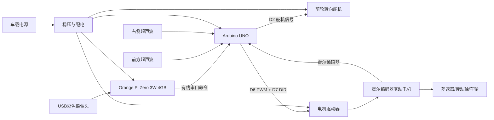
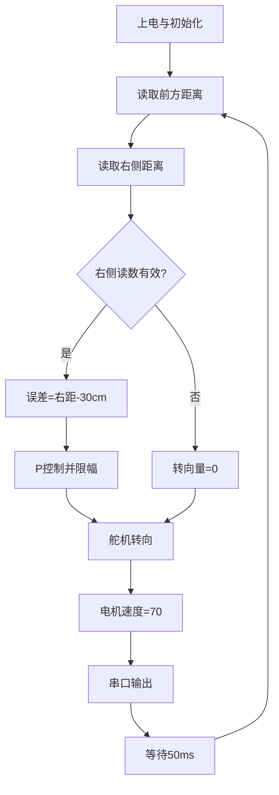

# 2026 WRO Future Engineers - Engineering Materials

> Team engineering repository for the 2026 WRO Future Engineers season. 中文说明在前，英文复现摘要见文末。

本仓库记录 2026 WRO 未来工程师参赛车辆从底盘选型、机电集成、控制软件到测试迭代的全过程。仓库目录沿用 WRO 官方 Future Engineers GitHub 模板，并按 2026 技术文档评分标准组织证据。当前车辆以 **RF-A101HE-109010203 阿克曼智能车底盘**为机械基础，采用 **Orange Pi Zero 3W 4GB** 进行摄像头视觉和高层决策，采用 **Arduino UNO** 执行超声波、编码器、舵机、电机与安全状态机。当前 Arduino 软件已实现右侧巡墙基础闭环；Orange Pi 视觉通信和完整障碍物挑战功能仍在迭代。

## 1. 仓库导航

| 目录/文件 | 内容 | 复现用途 |
|---|---|---|
| `README.md` | 总体技术说明、设计依据、搭建与下载步骤 | 裁判入口与总体复现 |
| `src源代码/` | Arduino 控制程序 | 编译并上传到车辆控制器 |
| `schemes原理图/` | 引脚表、供电与接线说明 | 复现电气连接 |
| `models模型/` | 底盘/安装件说明及后续 CAD 文件入口 | 复现机械结构 |
| `other其他/` | 测试方法、工程决策、风险和版本日志 | 追溯研发过程 |
| `t-photos团队照片/` | 团队照片候选素材 | 最终保留官方照和趣味照 |
| `v-photos车辆照片/` | 车辆六视图（待补齐） | 检查机械与布线 |
| `video视频/video.md` | 自动驾驶演示链接（待补） | 不少于 30 秒的驾驶证明 |

### 详细工程文件

- [物料表与选型依据](other其他/BOM.md)
- [Orange Pi Zero 3W 处理器与车载计算方案](other其他/processor-orange-pi.md)
- [摄像头规格、安装与视觉方案](other其他/camera-vision.md)
- [机械设计与理论计算](other其他/mechanical-analysis.md)
- [软件架构与状态机](other其他/software-architecture.md)
- [标定与参数调优手册](other其他/calibration-guide.md)
- [故障模式与风险分析](other其他/FMEA.md)
- [完整复现指南](other其他/reproduction-guide.md)
- [工程研发日志](other其他/engineering-log.md)
- [比赛前检查表](other其他/competition-checklist.md)
- [测试流程与数据表](other其他/tests.md)
- [版本迭代记录](other其他/CHANGELOG.md)

## 2. 系统概述

车辆采用汽车式阿克曼转向，而不是左右轮差速转向。团队确认的底盘规格为前轮转向、四轮驱动；四根转向拉杆将舵机动作传到左右转向节，并提供转角保护与微调；车体具有前后差速器和中间传动轴；霍尔编码器电机可以反馈转速与方向。原 `main1.0` 程序暂未读取编码器，新增比赛基础程序已经加入编码器速度闭环。

团队根据实车与规格图确认，底盘总体尺寸为 **260 × 140 × 85 mm**；去掉前后防撞棉后主体长度约 **246 mm**。轴距 **174 mm**，轮距 **123 mm**，车轮直径 **47 mm**，离地间隙 **6 mm**，整车基础重量约 **0.7 kg**，标称可附加载荷 **0.3 kg**，最小转弯半径 **475 mm**。最终上场尺寸仍应在安装摄像头、主控、电池和传感器后重新测量。

系统信号链如下：

## 3. 移动性与机械设计

### 3.1 底盘方案

选择 RF-A101HE 阿克曼底盘的原因是它的运动方式接近真实汽车，符合未来工程师赛项对非差速转向机构、运动学理解和稳定行驶的关注。前轮通过舵机和四连杆共同转向，电机经前后差速器和中间传动轴驱动四轮。相较于左右独立电机差速底盘，阿克曼机构的优点是高速直线稳定、转弯轨迹连续、轮胎侧滑较小；代价是最小转弯半径受轴距和最大转角限制，低速原地调整能力较弱，转向中位与左右极限必须标定。

飞书资料与底盘参数图均说明该底盘采用前轮转向、四轮驱动，并具备前后差速器与中间传动轴。差速器允许内外侧车轮在转弯时以不同转速滚动，减少轮胎拖滑。最终仍应把实车传动照片、齿数与电机标牌记录补入 `models模型/README.md`，用于证明装配与规格一致。

### 3.2 转向范围与保护

代码将逻辑转向量 `-100...100` 映射到舵机 `35...145°`，中位约为 `90°`。软件再将巡墙输出限制在 `-90...90`，避免舵机长期顶到机械限位。正式比赛前应举起车轮完成左右极限标定：逐步改变舵机角度，观察拉杆、转向节和轮胎是否发生干涉；以不产生机械顶死的安全角度作为最终上下限。更换舵机、舵臂孔位或拉杆长度后必须重新标定。

### 3.3 扭矩、速度与几何论证

底盘规格图提供轮径 47 mm、齿轮速比 1:8.864、车轮转速 1692 rpm、12 V 参考速度 3.5 m/s、额定电流 1.9 A、额定功率 22.8 W，以及舵机 10 kg·cm 标称扭矩。计算按下式进行：

- 理论车速：`v = π × D × n_motor / (60 × i)`，其中 `D` 为驱动轮直径，`n_motor` 为电机转速，`i` 为总减速比。
- 轮端扭矩：`T_wheel = T_motor × i × η`，其中 `η` 为传动效率。
- 牵引力：`F = T_wheel / (D/2)`。
- 理论阿克曼最小转弯半径：可由轴距 `L`、轮距 `W` 和内轮最大转角计算，并以地面画圆实测校核。

规格参数仍需通过实车验证，尤其是空载/负载速度、启动电流、满载质量、最大转角、实际转弯半径以及完整回合时间。`other其他/tests.md` 提供统一测试表格。规格图中的 1692 rpm 按 47 mm 轮径换算约 4.17 m/s，高于图中 3.5 m/s 的 12 V 参考速度，可能分别对应理论空载值与实际参考值，因此文档保留两者并要求实测。

## 4. 动力与传感器架构

### 4.1 控制器与执行器

控制系统采用高低层分工。Orange Pi Zero 3W 4GB 是车载视觉计算机，负责 USB 摄像头、OpenCV 图像处理和高层行为决策；Arduino UNO 是实时控制器，负责传感器、执行器和紧急停车。飞书资料指出底板预留 UNO R3 固定孔位，控制板也可安装在顶部亚克力板；顶部前端有部分激光雷达安装孔，后部通孔可固定其他控制板。当前版本使用一个转向舵机和一个电机驱动通道。舵机线序为：棕色 GND、红色 VCC 4.5-7 V、黄色信号线。舵机信号接 D2。电机驱动器接 D6 PWM 和 D7 DIR。

舵机、驱动电机和 Orange Pi 均不应直接由 UNO 的 5 V 引脚供电。推荐采用电池到电机驱动器的动力支路、Orange Pi 的独立 5 V/3 A 稳压支路，以及控制器/传感器/舵机支路，并确保所有信号设备共地。最终接线必须以实车电源模块额定值为准，详见 `schemes原理图/wiring.md`。

### 4.2 传感器布局

当前安装两个超声波测距模块：

- 前方传感器：TRIG=D3，ECHO=D4，用于观察前方距离。当前代码读取并打印该数值，但尚未用它触发转弯或紧急停止。
- 右侧传感器：TRIG=D8，ECHO=D9，是右侧巡墙控制的主要输入。目标墙距为 30 cm。

右侧传感器应尽量与车身纵向轴线平行，并避开轮胎、立柱和亚克力板遮挡。前方传感器应朝车辆正前方。超声波容易受斜面反射、相邻传感器串扰、软质材料和近距离盲区影响，因此程序采用顺序测量，并将 30 ms 无回波结果标记为 999 cm。正式标定时应在 10、20、30、40、50 cm 处分别采样至少 20 次，记录均值、标准差和失效率。

障碍物视觉传感器采用 USB 摄像头模组，由 Orange Pi Zero 3W 处理。团队购买的具体 SKU 为 **160°广角有畸变、30 FPS 彩色画面、非夜视、480p**，商品标题标注 GC0308，页面参数标注 HBVCAM 品牌、CMOS、30 万像素和 USB 有线免驱。彩色输出用于区分红色与绿色障碍物；160°视场可同时观察赛道两侧，但桶形畸变明显，必须通过相机标定和感兴趣区域裁剪处理。详见 `other其他/camera-vision.md` 与 `other其他/processor-orange-pi.md`。

### 4.3 动力预算

由于电池、稳压模块、电机、舵机和传感器的实物型号/额定电流尚未提供，目前不能给出可信总电流。应使用以下预算方法：

`I_peak = I_motor_start + I_servo_stall + I_orange_pi + I_controller + I_sensors + safety_margin`

Orange Pi 支路按 5 V/3 A 设计，但 3 A 是供电规格而不是已测典型电流。稳压模块连续额定电流应高于典型工作电流，瞬态能力应覆盖 Orange Pi 启动、USB 摄像头、电机启动与舵机快速转向。实测时分别记录静止、视觉运行、直行、最大转向和电机启动工况的电池电压与电流；若 UNO 或 Orange Pi 复位、USB 断连或传感器跳变，应优先检查共地、稳压余量、电机噪声和线束压降。

## 5. 软件架构与控制策略

### 5.1 当前程序

入口程序：`src源代码/main1.0/main1.0.ino`。程序依赖 Arduino 标准 `Servo` 库，控制周期约 50 ms。主要函数：

| 函数 | 功能 |
|---|---|
| `getDistance()` | 发送 10 μs 触发脉冲，使用 `pulseIn` 测量回波；30 ms 超时返回 999 |
| `move()` | 将 -100...100 的速度指令转成方向与 0...255 PWM |
| `steer()` | 将 -100...100 的转向指令映射到舵机安全角度 |
| `setup()` | 配置引脚、舵机中位、电机停止和串口日志 |
| `loop()` | 读取两路距离、计算巡墙误差、输出转向和速度、打印调试数据 |

### 5.2 右侧巡墙 P 控制

目标右侧距离 `TARGET_DIST=30 cm`，比例系数 `KP=2.5`，驱动速度 `DRIVE_SPEED=70`。控制律为：

`error = measured_right_distance - target_distance`

`steer = clamp(KP × error, -MAX_STEER, MAX_STEER)`

当车辆离右墙过远，误差为正，输出右转；离墙过近时误差为负，输出左转。当右侧读数无效（大于等于 500 cm）时保持直行。该算法结构简单、计算量小，适合 UNO 基线验证；缺点是没有积分项消除长期偏差，也没有微分项抑制振荡。调参时应先低速运行，从小 KP 增大，直到响应足够快但不出现持续蛇形。

### 5.3 已知边界情况与升级计划

当前前方距离尚未参与决策，因此车辆遇到封闭端或立柱时不会主动停车/转向；当前代码也没有红绿障碍物识别、方向识别、停车区处理、圈数统计或启动按键状态机。这些是明确的未完成功能，不能把本版本描述为最终障碍赛程序。

下一阶段建议采用状态机：`WAIT_START -> FOLLOW_WALL -> APPROACH_CORNER -> TURN -> FOLLOW_WALL`，并在障碍赛扩展 `DETECT_OBSTACLE`、`PASS_LEFT/RIGHT`、`RECOVER` 与 `PARK`。前方距离需加入减速和紧急停止阈值；右侧距离宜使用中值滤波；霍尔编码器应加入速度 PID，使电池电压变化时车速保持一致。所有参数变更都应在 `other其他/tests.md` 留下日期、场景和结果。

## 6. 系统思维与工程决策

### 决策 1：阿克曼转向而非左右差速

选择阿克曼机构是为了获得更接近汽车的转向运动学和更好的高速稳定性，也符合所选成品底盘的机械结构。代价是转弯半径更大、机械标定要求更高。团队用软件限幅降低舵机顶死风险，并计划通过实测最小转弯半径判断能否在不同内墙布置下稳定通过。

### 决策 2：先用超声波 P 控制建立可运行基线

相比直接上视觉和复杂融合，两路超声波加 P 控制更容易确认底盘、舵机、电机驱动和控制方向是否正确，调试链条短。代价是不能识别障碍物颜色，对斜向墙面也不够稳定。该方案定位为 V1 基线，不是最终方案。

### 决策 3：软件限位与无回波降级

转向同时受物理舵机角度范围和 `MAX_STEER` 控制输出限幅保护。超声波无回波时不使用异常距离参与 P 控制，而是直行并在串口显示 999。直行降级仍可能在前方封闭时产生风险，因此最终版必须增加前方安全状态和电机停止条件。

## 7. 搭建、编译与上传

1. 将 Arduino UNO 固定到底部预留孔位或顶部亚克力板，确保螺钉不接触焊点。
2. 按 `schemes原理图/wiring.md` 连接舵机、电机驱动器和两路超声波，共地后再次核对电压。
3. 先抬起驱动轮上电，确认舵机中位不会撞限位，电机方向与命令一致。
4. 安装 Arduino IDE，使用 USB 数据线连接 UNO；若为 CH340 接口，在 Windows 设备管理器中查找对应 COM 端口。
5. 打开 `src源代码/main1.0/main1.0.ino`，开发板选择 `Arduino Uno`，选择正确端口。
6. 编译并上传。打开 9600 baud 串口监视器，检查前方/右侧距离、误差、转向和速度日志。
7. 车辆落地后先以低速度短距离测试，再按 `other其他/tests.md` 完成传感器、直行、巡墙和失效测试。

## 8. 测试、风险与版本管理

测试方法和记录模板见 `other其他/tests.md`；版本变化见 `other其他/CHANGELOG.md`。主要风险包括：舵机机械顶死、电机启动压降导致 UNO 重启、超声波无回波、左右转向符号接反、线束松脱、轮胎打滑、程序上电即行驶以及比赛规则禁止的无线通信未关闭。每次比赛前应完成静态接线检查、抬轮执行器检查、低速场地检查和完整回合测试。

现有 Git 历史已经超过 3 次提交，但提交说明较简略。后续应使用可追溯说明，例如：`docs: add measured power budget`、`control: tune wall-following KP from test data`、`hardware: add final wiring diagram`，并在规定截止日前提交关键材料。仓库需保持公开，并在比赛后至少 12 个月可访问。

## 9. 提交前缺口清单

- [ ] 补充车辆前、后、左、右、顶、底六视图到 `v-photos车辆照片/`。
- [ ] 从团队照片中选定 1 张正式照和 1 张趣味照，其余移入候选子目录。
- [ ] 在 `video视频/video.md` 填入公开/可访问的自动驾驶视频，驾驶片段不少于 30 秒。
- [ ] 上传最终 CAD/STL/尺寸图、传动参数与传感器安装尺寸。
- [ ] 上传最终电路图，并填写电池、稳压、电机、舵机、驱动器、传感器的准确型号。
- [ ] 完成轮径、轴距、轮距、重量、速度、扭矩/电流、转弯半径实测。
- [ ] 增加启动按钮流程，确认比赛期间关闭无线通信。
- [ ] 完成前方安全、转弯状态机、障碍物识别与停车策略。
- [ ] 将最终 README 英文版扩展为不少于赛事要求的篇幅；国际赛提交必须使用英文。

---

## English reproducibility summary

The vehicle uses the RF-A101HE-109010203 Ackermann chassis described in the team's Feishu reference. Its front wheels are steered by a servo through four linkage rods, while the drivetrain uses a Hall-encoder motor, differentials and a longitudinal shaft. The controller is an Arduino UNO. The current baseline has two ultrasonic sensors: a front sensor on D3/D4 and a right-facing sensor on D8/D9. Steering uses D2; the motor driver uses D6 PWM and D7 direction.

The current software follows the right wall with proportional control. It targets 30 cm, uses `KP=2.5`, limits the steering command, drives at command 70 and repeats every 50 ms. An invalid right-side echo causes a straight-driving fallback. The front reading is currently diagnostic only. Therefore this revision demonstrates the electromechanical baseline but is not yet the final obstacle-challenge program.

To reproduce the baseline, assemble the UNO and sensors according to `schemes原理图/wiring.md`, keep all grounds common, power the servo and motor driver from correctly rated supplies, open the `.ino` file in Arduino IDE, select Arduino Uno and the CH340 COM port, compile, upload, and monitor the serial output at 9600 baud. First test with the wheels lifted, then use the staged procedure in `other其他/tests.md`.

Unknown component ratings and mechanical dimensions are intentionally marked for measurement. They must be replaced by verified values before final judging. This repository does not claim unimplemented obstacle recognition, parking or encoder-speed control.

## Sources

- WRO official Future Engineers repository template: <https://github.com/world-robot-olympiad-association/wro2022-fe-template>
- Team chassis reference: <https://pjfcckenlt.feishu.cn/wiki/WlCXwfJRCixkGPkZvTIcfUI6nHg>
- 2026 competition rules and technical-document rubric supplied by the team.
