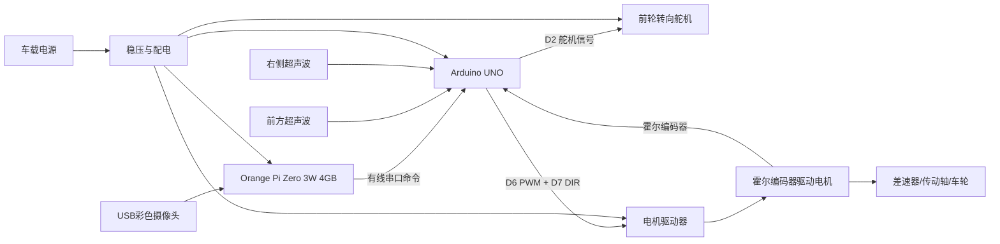
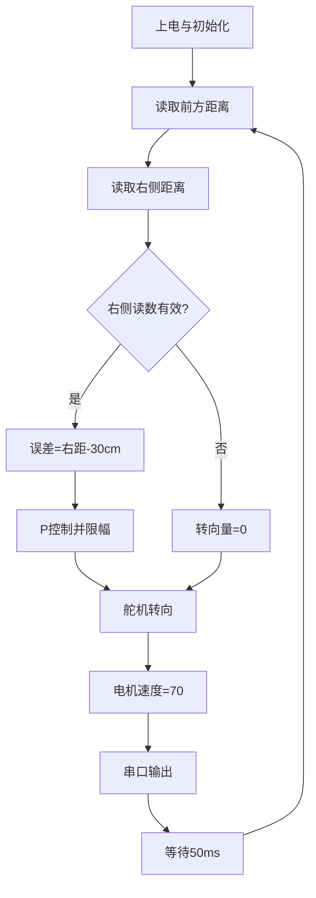

# 南京博颂学校 | 2026 WRO Future Engineers Engineering Materials

> Team engineering repository for the 2026 WRO Future Engineers season. 中文说明在前，英文复现摘要见文末。

本仓库是 **南京博颂学校 / Nanjing Bosong School** 参加 2026 WRO Future Engineers 的公开工程材料。仓库沿用官方 Future Engineers 模板，记录底盘、机电集成、Orange Pi视觉算法、Arduino底层控制、测试、安全分析、团队资料与演示视频。

车辆以 **RF-A101HE-109010203 阿克曼四驱底盘**为机械基础，使用 **Orange Pi Zero 3W 4GB** 处理USB摄像头和高层视觉策略，使用 **Arduino UNO（最终底层版本仍待确认）** 管理传感器、舵机、电机与安全停车。右侧巡墙Arduino基线和Python视觉原型均已入库；完整障碍挑战仍须经过实车标定、通信看门狗与可靠性测试后才能标为比赛最终版。

## 演示视频 / Driving Video

### [▶ 在 YouTube 观看：2026 WRO Future Engineers | 南京博颂学校 | Autonomous Driving Demonstration](https://youtu.be/DJcxiJCEFdo)

视频详情、原片参数与对应版本记录见 [`video视频/video.md`](video视频/video.md)。

## 快速跳转

- [系统概述](#2-系统概述) · [机械设计](#3-移动性与机械设计) · [动力与传感器](#4-动力与传感器架构) · [软件与算法](#5-软件架构与控制策略)
- [源代码总览](src源代码/README.md) · [接线与供电](schemes原理图/wiring.md) · [机械模型](models模型/README.md) · [物料表](other其他/BOM.md)
- [测试记录](other其他/tests.md) · [工程日志](other其他/engineering-log.md) · [FMEA](other其他/FMEA.md) · [比赛检查表](other其他/competition-checklist.md)
- [团队照片](t-photos团队照片/README.md) · [车辆照片要求](v-photos车辆照片/README.md) · [视频资料](video视频/video.md) · [完整文件索引](#10-完整文件索引)

## 当前成果状态

| 项目 | 仓库状态 | 验证状态 |
|---|---|---|
| 阿克曼底盘尺寸与结构 | 已形成机械说明并加入层板DXF | 商品规格已核对，最终装车尺寸待测 |
| Arduino右侧巡墙 | `main1.0` 已入库 | 基线代码，前方安全和启动状态不足 |
| Arduino/ESP32开放赛道版本 | 3个驱动/主控版本已入库 | 静态检查完成，最终实车版本待选 |
| Orange Pi道路预处理 | `bev_road.py` 已入库 | Python语法通过，透视标定仍为实验配置 |
| Orange Pi红绿视觉控制 | `bev_segmentation.py` 已入库 | Python语法通过，板端/实车/通信安全待验 |
| YouTube自动驾驶演示 | 链接已公开提供 | 需补拍摄日期、提交号和硬件参数对应表 |
| 团队照片 | 11张候选图已入库 | 正式照与趣味照尚未最终命名 |
| 车辆六视图 | 拍摄规范已入库 | 六方向最终实车照片尚未上传 |

## 1. 仓库导航

| 目录/文件 | 内容 | 复现用途 |
|---|---|---|
| [`README.md`](README.md) | 总体技术说明、视频、状态和完整导航 | 裁判首页与总体复现 |
| [`src源代码/`](src源代码/README.md) | Arduino/ESP32底层程序与Orange Pi视觉程序 | 编译、运行和算法审查 |
| [`schemes原理图/`](schemes原理图/wiring.md) | 引脚表、串口、供电与接线说明 | 复现电气连接 |
| [`models模型/`](models模型/README.md) | 底盘结构、尺寸和层板DXF | 复现机械结构 |
| [`other其他/`](other其他/engineering-log.md) | 物料、测试、标定、风险和版本日志 | 追溯研发过程 |
| [`t-photos团队照片/`](t-photos团队照片/README.md) | 11张团队研发照片 | 选择正式照和趣味照 |
| [`v-photos车辆照片/`](v-photos车辆照片/README.md) | 车辆六视图拍摄规范（照片待补） | 检查机械与布线 |
| [`video视频/`](video视频/video.md) | YouTube演示链接与本地原片参数 | 驾驶证明与版本追溯 |

### 详细工程文件

- [物料表与选型依据](other其他/BOM.md)
- [源代码、运行方法与验证状态](src源代码/README.md)
- [接线、串口与供电说明](schemes原理图/wiring.md)
- [机械模型、尺寸与层板DXF](models模型/README.md)
- [Orange Pi Zero 3W 处理器与车载计算方案](other其他/processor-orange-pi.md)
- [摄像头规格、安装与视觉方案](other其他/camera-vision.md)
- [机械设计与理论计算](other其他/mechanical-analysis.md)
- [软件架构与状态机](other其他/software-architecture.md)
- [标定与参数调优手册](other其他/calibration-guide.md)
- [故障模式与风险分析](other其他/FMEA.md)
- [完整复现指南](other其他/reproduction-guide.md)
- [工程研发日志](other其他/engineering-log.md)
- [比赛前检查表](other其他/competition-checklist.md)
- [测试流程与数据表](other其他/tests.md)
- [版本迭代记录](other其他/CHANGELOG.md)
- [团队照片说明](t-photos团队照片/README.md)
- [车辆六视图要求](v-photos车辆照片/README.md)
- [演示视频与版本记录](video视频/video.md)

## 2. 系统概述

车辆采用汽车式阿克曼转向，而不是左右轮差速转向。团队确认的底盘规格为前轮转向、四轮驱动；四根转向拉杆将舵机动作传到左右转向节，并提供转角保护与微调；车体具有前后差速器和中间传动轴；霍尔编码器电机可以反馈转速与方向。原 `main1.0` 程序暂未读取编码器，新增比赛基础程序已经加入编码器速度闭环。

团队根据实车与规格图确认，底盘总体尺寸为 **260 × 140 × 85 mm**；去掉前后防撞棉后主体长度约 **246 mm**。轴距 **174 mm**，轮距 **123 mm**，车轮直径 **47 mm**，离地间隙 **6 mm**，整车基础重量约 **0.7 kg**，标称可附加载荷 **0.3 kg**，最小转弯半径 **475 mm**。最终上场尺寸仍应在安装摄像头、主控、电池和传感器后重新测量。

系统信号链如下：

## 3. 移动性与机械设计

### 3.1 底盘方案

选择 RF-A101HE 阿克曼底盘的原因是它的运动方式接近真实汽车，符合未来工程师赛项对非差速转向机构、运动学理解和稳定行驶的关注。前轮通过舵机和四连杆共同转向，电机经前后差速器和中间传动轴驱动四轮。相较于左右独立电机差速底盘，阿克曼机构的优点是高速直线稳定、转弯轨迹连续、轮胎侧滑较小；代价是最小转弯半径受轴距和最大转角限制，低速原地调整能力较弱，转向中位与左右极限必须标定。

飞书资料与底盘参数图均说明该底盘采用前轮转向、四轮驱动，并具备前后差速器与中间传动轴。差速器允许内外侧车轮在转弯时以不同转速滚动，减少轮胎拖滑。最终仍应把实车传动照片、齿数与电机标牌记录补入 `models模型/README.md`，用于证明装配与规格一致。

### 3.2 转向范围与保护

代码将逻辑转向量 `-100...100` 映射到舵机 `35...145°`，中位约为 `90°`。软件再将巡墙输出限制在 `-90...90`，避免舵机长期顶到机械限位。正式比赛前应举起车轮完成左右极限标定：逐步改变舵机角度，观察拉杆、转向节和轮胎是否发生干涉；以不产生机械顶死的安全角度作为最终上下限。更换舵机、舵臂孔位或拉杆长度后必须重新标定。

### 3.3 扭矩、速度与几何论证

底盘规格图提供轮径 47 mm、齿轮速比 1:8.864、车轮转速 1692 rpm、12 V 参考速度 3.5 m/s、额定电流 1.9 A、额定功率 22.8 W，以及舵机 10 kg·cm 标称扭矩。计算按下式进行：

- 理论车速：`v = π × D × n_motor / (60 × i)`，其中 `D` 为驱动轮直径，`n_motor` 为电机转速，`i` 为总减速比。
- 轮端扭矩：`T_wheel = T_motor × i × η`，其中 `η` 为传动效率。
- 牵引力：`F = T_wheel / (D/2)`。
- 理论阿克曼最小转弯半径：可由轴距 `L`、轮距 `W` 和内轮最大转角计算，并以地面画圆实测校核。

规格参数仍需通过实车验证，尤其是空载/负载速度、启动电流、满载质量、最大转角、实际转弯半径以及完整回合时间。`other其他/tests.md` 提供统一测试表格。规格图中的 1692 rpm 按 47 mm 轮径换算约 4.17 m/s，高于图中 3.5 m/s 的 12 V 参考速度，可能分别对应理论空载值与实际参考值，因此文档保留两者并要求实测。

## 4. 动力与传感器架构

### 4.1 控制器与执行器

控制系统采用高低层分工。Orange Pi Zero 3W 4GB 是车载视觉计算机，负责 USB 摄像头、OpenCV 图像处理和高层行为决策；Arduino UNO 是实时控制器，负责传感器、执行器和紧急停车。飞书资料指出底板预留 UNO R3 固定孔位，控制板也可安装在顶部亚克力板；顶部前端有部分激光雷达安装孔，后部通孔可固定其他控制板。当前版本使用一个转向舵机和一个电机驱动通道。舵机线序为：棕色 GND、红色 VCC 4.5-7 V、黄色信号线。舵机信号接 D2。电机驱动器接 D6 PWM 和 D7 DIR。

舵机、驱动电机和 Orange Pi 均不应直接由 UNO 的 5 V 引脚供电。推荐采用电池到电机驱动器的动力支路、Orange Pi 的独立 5 V/3 A 稳压支路，以及控制器/传感器/舵机支路，并确保所有信号设备共地。最终接线必须以实车电源模块额定值为准，详见 `schemes原理图/wiring.md`。

### 4.2 传感器布局

当前安装两个超声波测距模块：

- 前方传感器：TRIG=D3，ECHO=D4，用于观察前方距离。当前代码读取并打印该数值，但尚未用它触发转弯或紧急停止。
- 右侧传感器：TRIG=D8，ECHO=D9，是右侧巡墙控制的主要输入。目标墙距为 30 cm。

右侧传感器应尽量与车身纵向轴线平行，并避开轮胎、立柱和亚克力板遮挡。前方传感器应朝车辆正前方。超声波容易受斜面反射、相邻传感器串扰、软质材料和近距离盲区影响，因此程序采用顺序测量，并将 30 ms 无回波结果标记为 999 cm。正式标定时应在 10、20、30、40、50 cm 处分别采样至少 20 次，记录均值、标准差和失效率。

障碍物视觉传感器采用 USB 摄像头模组，由 Orange Pi Zero 3W 处理。团队购买的具体 SKU 为 **160°广角有畸变、30 FPS 彩色画面、非夜视、480p**，商品标题标注 GC0308，页面参数标注 HBVCAM 品牌、CMOS、30 万像素和 USB 有线免驱。彩色输出用于区分红色与绿色障碍物；160°视场可同时观察赛道两侧，但桶形畸变明显，必须通过相机标定和感兴趣区域裁剪处理。详见 `other其他/camera-vision.md` 与 `other其他/processor-orange-pi.md`。

### 4.3 动力预算

由于电池、稳压模块、电机、舵机和传感器的实物型号/额定电流尚未提供，目前不能给出可信总电流。应使用以下预算方法：

`I_peak = I_motor_start + I_servo_stall + I_orange_pi + I_controller + I_sensors + safety_margin`

Orange Pi 支路按 5 V/3 A 设计，但 3 A 是供电规格而不是已测典型电流。稳压模块连续额定电流应高于典型工作电流，瞬态能力应覆盖 Orange Pi 启动、USB 摄像头、电机启动与舵机快速转向。实测时分别记录静止、视觉运行、直行、最大转向和电机启动工况的电池电压与电流；若 UNO 或 Orange Pi 复位、USB 断连或传感器跳变，应优先检查共地、稳压余量、电机噪声和线束压降。

## 5. 软件架构与控制策略

### 5.1 当前程序

仓库现在包含底层控制和高层视觉两类程序，完整说明与运行命令见 [`src源代码/README.md`](src源代码/README.md)。

| 层级 | 程序 | 已实现内容 | 当前边界 |
|---|---|---|---|
| Arduino基线 | [`main1.0.ino`](src源代码/main1.0/main1.0.ino) | 双超声波读取、舵机、电机、右侧30 cm巡墙P控制 | 无独立启动、前方停车和视觉通信 |
| Arduino开放赛道 | [`UNO_AT8236`](src源代码/UNO_AT8236_OpenChallenge/UNO_AT8236_OpenChallenge.ino) / [`UNO_DRV8701`](src源代码/UNO_DRV8701_OpenChallenge/UNO_DRV8701_OpenChallenge.ino) | 启动状态、滤波、转弯、紧急停车、编码器速度PI | 必须按实车驱动器二选一并实测 |
| ESP32试验版 | [`ESP32_AT8236`](src源代码/ESP32_AT8236_OpenChallenge/ESP32_AT8236_OpenChallenge.ino) | AT8236控制及主动关闭无线 | 比赛底层是否使用ESP32待确认 |
| 道路实验工具 | [`bev_road.py`](src源代码/bev_road.py) | 亮度归一化、实验性BEV、道路掩膜、连通域显示 | 透视源点尚未按实车地面标定 |
| 视觉控制原型 | [`bev_segmentation.py`](src源代码/bev_segmentation.py) | 红绿HSV检测、CW/CCW策略、道路密度、串口命令、避障恢复仪表板 | 缺少比赛级协议、底层看门狗和完整实车数据 |

本轮检查确认两份Python文件语法可解析，并对视觉主程序做了最小安全修正：默认目标速度改为0；减速阈值低于避障阈值；制动阶段先停车；视频源丢失和程序退出时发送停止命令。代码仍须在Orange Pi、摄像头、Arduino和真实场地上完成集成验证。

Arduino基线程序依赖标准 `Servo` 库，控制周期约50 ms。主要函数：

| 函数 | 功能 |
|---|---|
| `getDistance()` | 发送 10 μs 触发脉冲，使用 `pulseIn` 测量回波；30 ms 超时返回 999 |
| `move()` | 将 -100...100 的速度指令转成方向与 0...255 PWM |
| `steer()` | 将 -100...100 的转向指令映射到舵机安全角度 |
| `setup()` | 配置引脚、舵机中位、电机停止和串口日志 |
| `loop()` | 读取两路距离、计算巡墙误差、输出转向和速度、打印调试数据 |

### 5.2 右侧巡墙 P 控制

目标右侧距离 `TARGET_DIST=30 cm`，比例系数 `KP=2.5`，驱动速度 `DRIVE_SPEED=70`。控制律为：

`error = measured_right_distance - target_distance`

`steer = clamp(KP × error, -MAX_STEER, MAX_STEER)`

当车辆离右墙过远，误差为正，输出右转；离墙过近时误差为负，输出左转。当右侧读数无效（大于等于 500 cm）时保持直行。该算法结构简单、计算量小，适合 UNO 基线验证；缺点是没有积分项消除长期偏差，也没有微分项抑制振荡。调参时应先低速运行，从小 KP 增大，直到响应足够快但不出现持续蛇形。

### 5.3 已知边界情况与升级计划

`main1.0` 的前方距离尚未参与决策，因此该基线遇到封闭端或立柱时不会主动停车/转向。新增Arduino开放赛道版本和Python视觉原型已经提供启动状态、转弯、红绿识别、CW/CCW策略与恢复状态机等代码结构，但尚不能据此宣称完整障碍赛已经验证。

当前Python串口仍是简单的 `steer,speed` 文本行，没有序号、时间戳、CRC和确认应答；默认图形界面依赖显示器；相机透视、HSV阈值、道路密度阈值、红绿通过侧、倒车时间和速度均是待标定参数。正式版还需完成：底层物理启动、命令超时停车、停车区、圈数、方向初始化、进程自动启动/恢复以及多光照长时间测试。所有参数变更都应在 [`other其他/tests.md`](other其他/tests.md) 留下日期、场景、代码提交号和结果。

## 6. 系统思维与工程决策

### 决策 1：阿克曼转向而非左右差速

选择阿克曼机构是为了获得更接近汽车的转向运动学和更好的高速稳定性，也符合所选成品底盘的机械结构。代价是转弯半径更大、机械标定要求更高。团队用软件限幅降低舵机顶死风险，并计划通过实测最小转弯半径判断能否在不同内墙布置下稳定通过。

### 决策 2：先用超声波 P 控制建立可运行基线

两路超声波加P控制用于先确认底盘、舵机、电机驱动和控制方向，调试链条较短。该基线不能识别障碍物颜色，对斜向墙面也不够稳定；因此团队随后加入Orange Pi视觉原型，但仍保留超声波基线作为硬件排错和安全降级依据。

### 决策 3：软件限位与无回波降级

转向同时受物理舵机角度范围和 `MAX_STEER` 控制输出限幅保护。超声波无回波时不使用异常距离参与 P 控制，而是直行并在串口显示 999。直行降级仍可能在前方封闭时产生风险，因此最终版必须增加前方安全状态和电机停止条件。

## 7. 搭建、编译与上传

1. 按 [`models模型/README.md`](models模型/README.md) 与层板DXF固定底盘、Orange Pi、Arduino、电源和传感器，确保螺钉不接触焊点。
2. 按 [`schemes原理图/wiring.md`](schemes原理图/wiring.md) 连接舵机、电机驱动器、超声波、摄像头和有线串口；Orange Pi使用独立5 V/3 A支路，所有信号设备共地。
3. 先抬起驱动轮上电，确认舵机中位、转向方向、电机方向和物理启动按钮；根据驱动板从 [`src源代码/README.md`](src源代码/README.md) 选择唯一Arduino程序。
4. 在Arduino IDE中编译上传并查看串口；原始 `main1.0` 使用9600 baud，新增开放赛道程序按各自源码配置使用115200 baud。
5. 在Orange Pi安装并冻结Python/OpenCV/PySerial环境，复制 [`serial_config.example.json`](src源代码/serial_config.example.json) 为 `serial_config.json` 并填写真实串口。
6. 先用录像运行 [`bev_road.py`](src源代码/bev_road.py) 和 [`bev_segmentation.py`](src源代码/bev_segmentation.py)，再接入摄像头；确认默认速度为0且CW/CCW、红绿通过侧和转向符号正确。
7. 车辆落地后从低速开始，依次完成传感器、直行、巡墙、红绿障碍、摄像头断开、串口断开、Orange Pi重启和30分钟稳定性测试。
8. 按 [`other其他/tests.md`](other其他/tests.md) 保存日期、提交号、参数和数据；按 [`video视频/video.md`](video视频/video.md) 记录演示视频对应的唯一软件/硬件版本。

## 8. 测试、风险与版本管理

测试方法和记录模板见 `other其他/tests.md`；版本变化见 `other其他/CHANGELOG.md`。主要风险包括：舵机机械顶死、电机启动压降导致 UNO 重启、超声波无回波、左右转向符号接反、线束松脱、轮胎打滑、程序上电即行驶以及比赛规则禁止的无线通信未关闭。每次比赛前应完成静态接线检查、抬轮执行器检查、低速场地检查和完整回合测试。

现有 Git 历史已经超过 3 次提交，但提交说明较简略。后续应使用可追溯说明，例如：`docs: add measured power budget`、`control: tune wall-following KP from test data`、`hardware: add final wiring diagram`，并在规定截止日前提交关键材料。仓库需保持公开，并在比赛后至少 12 个月可访问。

## 9. 提交前缺口清单

- [x] 已提供公开YouTube自动驾驶演示链接，视频约1分47秒。
- [x] 已加入Arduino/ESP32底层程序、Orange Pi视觉原型及源码说明。
- [x] 已加入层板DXF、物料表、接线说明、风险、标定、测试和复现文档。
- [ ] 补充车辆前、后、左、右、顶、底六视图到 [`v-photos车辆照片/`](v-photos车辆照片/README.md)。
- [ ] 从11张团队候选照片中选定1张正式照和1张趣味照，并使用规则要求的最终文件名。
- [ ] 在 [`video视频/video.md`](video视频/video.md) 填写拍摄日期、对应提交号、驱动器、控制器、电池和参数；本地132.37 MiB原片不应直接用普通Git推送。
- [ ] 上传最终 CAD/STL/尺寸图、传动参数与传感器安装尺寸。
- [ ] 上传最终电路图，并填写电池、稳压、电机、舵机、驱动器、传感器的准确型号。
- [ ] 完成轮径、轴距、轮距、重量、速度、扭矩/电流、转弯半径实测。
- [ ] 在最终底层程序中确认物理启动按钮、通信超时和前方紧急停车，并关闭全部无线通信。
- [ ] 完成视觉透视标定、红绿识别数据、圈数、停车区和最终停车策略。
- [ ] 将最终 README 英文版扩展为不少于赛事要求的篇幅；国际赛提交必须使用英文。

## 10. 完整文件索引

### 程序与配置

| 文件 | 内容 |
|---|---|
| [`src源代码/README.md`](src源代码/README.md) | 所有程序的运行方法、依赖、安全边界和验证状态 |
| [`main1.0/main1.0.ino`](src源代码/main1.0/main1.0.ino) | 原始Arduino UNO右侧巡墙P控制 |
| [`UNO_AT8236_OpenChallenge.ino`](src源代码/UNO_AT8236_OpenChallenge/UNO_AT8236_OpenChallenge.ino) | UNO + AT8236开放赛道基础版 |
| [`UNO_DRV8701_OpenChallenge.ino`](src源代码/UNO_DRV8701_OpenChallenge/UNO_DRV8701_OpenChallenge.ino) | UNO + DRV8701/MD02 Pro开放赛道基础版 |
| [`ESP32_AT8236_OpenChallenge.ino`](src源代码/ESP32_AT8236_OpenChallenge/ESP32_AT8236_OpenChallenge.ino) | ESP32 + AT8236试验版 |
| [`bev_road.py`](src源代码/bev_road.py) | 道路掩膜、实验性BEV和连通域调试工具 |
| [`bev_segmentation.py`](src源代码/bev_segmentation.py) | 红绿视觉、CW/CCW策略、串口控制和避障恢复原型 |
| [`requirements.txt`](src源代码/requirements.txt) | Python依赖参考 |
| [`serial_config.example.json`](src源代码/serial_config.example.json) | Orange Pi串口配置示例 |

### 机械、电气与工程文档

| 文件 | 内容 |
|---|---|
| [`models模型/README.md`](models模型/README.md) | 底盘结构、尺寸和待补模型说明 |
| [`HSP94182层板.dxf`](models模型/HSP94182层板.dxf) | 二维层板加工/孔位文件 |
| [`schemes原理图/wiring.md`](schemes原理图/wiring.md) | Arduino引脚、Orange Pi串口、供电预算和接线原则 |
| [`BOM.md`](other其他/BOM.md) | 物料表与选型依据 |
| [`processor-orange-pi.md`](other其他/processor-orange-pi.md) | Orange Pi Zero 3W 4GB规格、职责、供电与验收 |
| [`camera-vision.md`](other其他/camera-vision.md) | USB摄像头规格、安装、标定和视觉指标 |
| [`mechanical-analysis.md`](other其他/mechanical-analysis.md) | 底盘几何、速度、转弯和机械分析 |
| [`software-architecture.md`](other其他/software-architecture.md) | 高低层架构、状态机和视觉数据流 |
| [`calibration-guide.md`](other其他/calibration-guide.md) | 舵机、编码器、速度、巡墙和摄像头标定 |
| [`FMEA.md`](other其他/FMEA.md) | 故障模式、风险优先数和改进措施 |
| [`reproduction-guide.md`](other其他/reproduction-guide.md) | 从机械装配到软件恢复的完整复现流程 |
| [`engineering-log.md`](other其他/engineering-log.md) | 分阶段研发成果、局限和实验计划 |
| [`competition-checklist.md`](other其他/competition-checklist.md) | 文件、机械、电气、软件和上场检查表 |
| [`tests.md`](other其他/tests.md) | 静态、传感器、动力、视觉和故障注入测试表 |
| [`CHANGELOG.md`](other其他/CHANGELOG.md) | 软件与文档版本迭代记录 |

### 照片与视频

- [YouTube自动驾驶演示](https://youtu.be/DJcxiJCEFdo) · [`video视频/video.md`](video视频/video.md)
- [`t-photos团队照片/README.md`](t-photos团队照片/README.md) · [研发现场1](t-photos团队照片/2026-05-30_14-57-55_523.jpg) · [研发现场2](t-photos团队照片/2026-05-30_14-58-03_706.jpg) · [研发现场3](t-photos团队照片/2026-05-30_14-58-05_895.jpg)
- [团队候选照01](t-photos团队照片/IMG_20251220_140837.jpg) · [02](t-photos团队照片/IMG_20251220_140841.jpg) · [03](t-photos团队照片/IMG_20251220_140844.jpg) · [04](t-photos团队照片/IMG_20251220_143704.jpg) · [05](t-photos团队照片/IMG_20251220_143706.jpg) · [06](t-photos团队照片/IMG_20251220_151008.jpg) · [07](t-photos团队照片/IMG_20251220_151010.jpg) · [08](t-photos团队照片/IMG_20251220_151015.jpg)
- [`v-photos车辆照片/README.md`](v-photos车辆照片/README.md)：六视图拍摄与命名要求；最终车辆照片尚待上传。

---

## English reproducibility summary

This repository contains the 2026 WRO Future Engineers engineering materials of Nanjing Bosong School. The public driving demonstration is available on [YouTube](https://youtu.be/DJcxiJCEFdo). The repository landing page links directly to all source code, mechanical files, wiring, BOM, calibration procedures, tests, risk analysis, photographs and video records.

The vehicle uses an RF-A101HE-109010203 Ackermann chassis with front-wheel steering, four-wheel mechanical drive, front and rear differentials and a longitudinal shaft. The documented base dimensions are 260 × 140 × 85 mm, with a 174 mm wheelbase, 123 mm track and 47 mm wheels. These catalogue values must still be checked on the final assembled vehicle.

The computing architecture is split into two levels. An Orange Pi Zero 3W 4GB receives the 480p/30 FPS USB colour camera and runs the Python/OpenCV vision prototype. The lower-level Arduino/ESP32 program reads ultrasonic sensors and the encoder, then drives the steering servo and motor driver. The Orange Pi has its own regulated 5 V/3 A supply. Wi-Fi and Bluetooth are not used during competition and must be disabled.

The original Arduino UNO baseline follows the right wall at a 30 cm target using proportional control. Additional UNO/ESP32 programs add filtering, state control, emergency stopping and encoder speed control for different motor-driver variants. The repository also contains `bev_road.py` for experimental road-mask/BEV visualisation and `bev_segmentation.py` for red/green beacon detection, clockwise/counter-clockwise strategies, lane-density steering, serial commands and recovery states.

Both Python files pass syntax parsing, but the visual controller remains an engineering prototype. The current serial format is a simple `steer,speed` line and still requires sequence numbers, timestamps, CRC, acknowledgement and a lower-level timeout watchdog. Real-camera perspective calibration, obstacle-detection statistics, parking, lap counting, physical start-button integration and long-duration vehicle tests are not yet complete. The documentation distinguishes implemented code from verified competition behaviour.

To reproduce the project, follow [`src源代码/README.md`](src源代码/README.md), [`schemes原理图/wiring.md`](schemes原理图/wiring.md), [`other其他/reproduction-guide.md`](other其他/reproduction-guide.md) and [`other其他/tests.md`](other其他/tests.md). First test with the wheels lifted and zero target speed, then validate camera loss, serial loss and processor restart before any full-speed run.

## Sources

- WRO official Future Engineers repository template: <https://github.com/world-robot-olympiad-association/wro2022-fe-template>
- Team chassis reference: <https://pjfcckenlt.feishu.cn/wiki/WlCXwfJRCixkGPkZvTIcfUI6nHg>
- 2026 competition rules and technical-document rubric supplied by the team.
