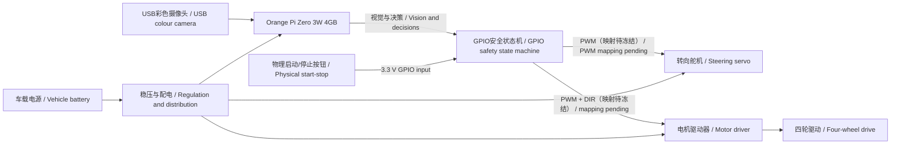

# 南京博颂学校 | 2026 WRO Future Engineers 工程材料 / Engineering Materials

> 本页面所有内容均为中文与英文直接对照。 / All content on this page is presented directly in Chinese and English.

本仓库是 **南京博颂学校 / BONA SONORITY SCHOOL NANJING** 参加 2026 WRO Future Engineers 的公开工程材料，沿用官方 Future Engineers 模板，记录底盘、机电集成、Orange Pi视觉与GPIO/PWM直接控制、测试、安全分析、团队资料与演示视频。

This public repository documents the 2026 WRO Future Engineers project of **BONA SONORITY SCHOOL NANJING**. It follows the official Future Engineers template and records the chassis, mechatronic integration, Orange Pi vision with direct GPIO/PWM control, tests, safety analysis, team materials and demonstration video.

车辆以阿克曼四轮驱动底盘为机械基础，只使用 **USB彩色摄像头**进行环境感知。**Orange Pi Zero 3W 4GB**在同一平台上完成视觉、路径决策、安全状态管理和GPIO/PWM执行，直接控制转向舵机与电机驱动器。当前车辆不安装Arduino，不使用超声波，也不读取编码器。

The vehicle uses a four-wheel-drive Ackermann chassis and a **USB colour camera as its only environmental sensor**. An **Orange Pi Zero 3W 4GB** performs vision, path decisions, safety-state management and GPIO/PWM execution on the same platform, directly controlling the steering servo and motor driver. The current vehicle has no Arduino, ultrasonic sensing or encoder feedback.

## 演示视频 / Driving Video

### [▶ YouTube：2026 WRO Future Engineers | 南京博颂学校 | Autonomous Driving Demonstration](https://youtu.be/DJcxiJCEFdo)

视频详情、原片参数与版本记录见 [`video视频/video.md`](video视频/video.md)。

See [`video视频/video.md`](video视频/video.md) for video details, local-file specifications and version records.

## 队伍与赛事成果 / Team and Competition

### 南京博颂学校 / BONA SONORITY SCHOOL NANJING

我们围绕视觉无人驾驶阿克曼车辆开展程序、结构和电子系统协作。

We collaborate on programming, mechanical structure and electronics for a vision-based autonomous Ackermann vehicle.

| 姓名 / Name | 分工 / Role |
|---|---|
| 陆昭颖 🏳️‍🌈 / Lu Zhaoying | 程序 / Programming |
| 张隽泽 / Zhang Junze | 结构 / Mechanical Structure |
| 黄鸣博 / Huang Mingbo | 电子 / Electronics |
| 薛源 / Xue Yuan | 教练 / Coach |

[查看完整团队介绍 / Read the full team profile](other其他/team-profile.md) · [陆昭颖自我介绍（中/英/日） / Lu Zhaoying profile (CN/EN/JP)](other其他/team-profile.md#lu-zhaoying-profile)

### 成员照片 / Member Portraits

| 陆昭颖 🏳️‍🌈 / Lu Zhaoying | 张隽泽 / Zhang Junze | 黄鸣博 / Huang Mingbo |
|---|---|---|
|  |  |  |

[陆昭颖形象照 / Additional portrait of Lu Zhaoying](t-photos团队照片/陆昭颖形象照.jpg)

### 正式团队照 / Official Team Photograph

### 2026 WRO中国区选拔赛（北京站）未来工程师无人驾驶冠军 / 2026 WRO China Qualification Tournament (Beijing) Future Engineers Autonomous Driving Champion

### 车辆比赛现场 / Vehicle on the Competition Field

更多研发记录见[制作过程照片索引](t-photos团队照片/README.md)。车辆标准六视图仍待补充。

See the [development-process photo index](t-photos团队照片/README.md) for more records. The standard six-view vehicle photographs are still pending.

## 快速跳转 / Quick Navigation

- [2026五维评分证据地图 / 2026 rubric evidence map](other其他/scoring-evidence.md) · [可归档工程日志PDF / Archival engineering-log PDF](other其他/engineering-log.pdf) · [实测与照片证据登记 / Evidence register](other其他/evidence-register.md)
- [团队介绍 / Team profile](other其他/team-profile.md) · [系统概述 / System overview](#2-系统概述--system-overview) · [机械设计 / Mechanical design](#3-移动性与机械设计--mobility-and-mechanical-design) · [动力与视觉 / Power and vision](#4-动力与视觉架构--power-and-vision-architecture)
- [源代码 / Source code](src源代码/README.md) · [接线与供电 / Wiring and power](schemes原理图/wiring.md) · [正式PNG接线图 / Formal PNG wiring diagram](schemes原理图/system-wiring.png) · [机械模型 / Mechanical models](models模型/README.md) · [物料表 / BOM](other其他/BOM.md)
- [测试 / Tests](other其他/tests.md) · [工程日志 / Engineering log](other其他/engineering-log.md) · [FMEA](other其他/FMEA.md) · [比赛检查表 / Competition checklist](other其他/competition-checklist.md)
- [团队照片 / Team photos](t-photos团队照片/README.md) · [车辆照片 / Vehicle photos](v-photos车辆照片/README.md) · [视频 / Video](video视频/video.md) · [完整索引 / Complete index](#10-完整文件索引--complete-file-index)

## 当前成果状态 / Current Project Status

| 项目 / Item | 仓库状态 / Repository Status | 验证状态 / Validation Status |
|---|---|---|
| 阿克曼底盘 / Ackermann chassis | 已有机械说明和层板DXF / Mechanical description and plate DXF included | 现有规格记录已整理，最终装车尺寸待测 / Existing specification record documented; final assembled dimensions pending |
| 超声波与编码器代码 / Ultrasonic and encoder code | 团队早期自主实验代码已入库 / Earlier team-developed experimental code included | 当前车辆不使用 / Not used by the current vehicle |
| 道路预处理 / Road preprocessing | `bev_road.py` 已入库 / Included | 透视参数仍需实车标定 / Perspective parameters require vehicle calibration |
| 红绿视觉控制 / Red-green vision control | `bev_segmentation.py` 已入库 / Included | 当前主要方向，仍需板端和实车验证 / Current main approach; board and vehicle validation pending |
| Orange Pi GPIO/PWM执行 / Orange Pi GPIO/PWM execution | `orange_pi_gpio.py`、安全状态机和配置模板已入库 / Driver, safety state machine and configuration template included | 默认禁用、上电停车、物理按钮、限幅、退出清零和250 ms进程看门狗已闭环；实际GPIO/PWM映射及硬件测试待完成 / Disabled-by-default, power-on stop, physical button, limits, zero-on-exit and 250 ms process watchdog implemented; actual mapping and hardware tests pending |
| 接线与配电 / Wiring and distribution | 现行GPIO直控PNG/SVG、供电分支和映射表已入库 / Current direct-GPIO PNG/SVG, power branches and mapping table included | 实际GPIO line、PWM chip/channel、逻辑电平、额定值和支路电流待实物核验 / Actual GPIO lines, PWM chip/channels, logic levels, ratings and branch currents require physical verification |
| 评分与工程日志 / Rubric and engineering log | 五维证据地图、缺失证据登记、双语PDF已入库 / Five-dimension map, gap register and bilingual PDF included | 实测后需更新PDF和签署 / PDF and sign-off require update after measurements |
| 驾驶演示 / Driving demonstration | YouTube链接和87.07 MiB视频已入库 / YouTube link and 87.07 MiB video included | 拍摄日期、提交号和硬件对应表待补 / Date, commit and hardware mapping pending |
| 团队材料 / Team materials | 队旗、介绍、三名成员照、正式照、冠军照和11张过程照已入库 / Flag, profile, three portraits, official photo, award photo and 11 process photos included | 趣味团队照待补 / Informal team photo pending |
| 车辆照片 / Vehicle photos | 比赛现场照片和六视图规范已入库 / Competition photo and six-view specification included | 标准六视图待补 / Standard six views pending |

## 1. 仓库导航 / Repository Navigation

| 目录或文件 / Folder or File | 内容 / Contents | 复现用途 / Reproduction Use |
|---|---|---|
| [`README.md`](README.md) | 总体技术说明、视频、状态和导航 / Overall documentation, video, status and navigation | 裁判首页与总体复现 / Landing page and system reproduction |
| [`src源代码/`](src源代码/README.md) | Orange Pi视觉、GPIO/PWM执行与历史实验 / Orange Pi vision, GPIO/PWM execution and historical experiments | 编译、运行和算法审查 / Build, execution and algorithm review |
| [`schemes原理图/`](schemes原理图/wiring.md) | GPIO/PWM映射、供电和接线 / GPIO/PWM mapping, power and wiring | 电气复现 / Electrical reproduction |
| [`models模型/`](models模型/README.md) | 底盘、尺寸和层板DXF / Chassis, dimensions and plate DXF | 机械复现 / Mechanical reproduction |
| [`other其他/`](other其他/engineering-log.md) | 物料、测试、标定、风险和日志 / BOM, tests, calibration, risk and logs | 工程追溯 / Engineering traceability |
| [`t-photos团队照片/`](t-photos团队照片/README.md) | 团队、赛事和制作过程照片 / Team, competition and development photos | 团队与过程证据 / Team and process evidence |
| [`v-photos车辆照片/`](v-photos车辆照片/README.md) | 比赛照片和六视图规范 / Competition photo and six-view specification | 车辆与布线检查 / Vehicle and wiring inspection |
| [`video视频/`](video视频/video.md) | YouTube链接和本地视频参数 / YouTube link and local video specifications | 驾驶证明与版本追溯 / Driving evidence and version traceability |

### 详细工程文件 / Detailed Engineering Documents

- [物料表与选型依据 / Bill of materials and selection](other其他/BOM.md)
- [2026评分证据地图 / 2026 scoring-evidence map](other其他/scoring-evidence.md)
- [实测与照片证据登记 / Measurement and photograph evidence register](other其他/evidence-register.md)
- [源代码、运行方法与验证状态 / Source code, operation and validation](src源代码/README.md)
- [GPIO/PWM接线与供电 / GPIO/PWM wiring and power](schemes原理图/wiring.md)
- [正式PNG接线图 / Formal PNG wiring diagram](schemes原理图/system-wiring.png)
- [机械模型、尺寸与DXF / Mechanical models, dimensions and DXF](models模型/README.md)
- [Orange Pi车载计算平台 / Orange Pi onboard computer](other其他/processor-orange-pi.md)
- [摄像头与视觉方案 / Camera and vision](other其他/camera-vision.md)
- [机械分析 / Mechanical analysis](other其他/mechanical-analysis.md)
- [软件架构 / Software architecture](other其他/software-architecture.md)
- [标定手册 / Calibration guide](other其他/calibration-guide.md)
- [风险分析 / Risk analysis](other其他/FMEA.md)
- [复现指南 / Reproduction guide](other其他/reproduction-guide.md)
- [工程日志Markdown / Engineering log in Markdown](other其他/engineering-log.md) · [可归档PDF / Archival PDF](other其他/engineering-log.pdf)
- [工程日志PDF生成脚本 / Engineering-log PDF build script](other其他/build_engineering_log_pdf.py)
- [团队介绍 / Team profile](other其他/team-profile.md)
- [比赛检查表 / Competition checklist](other其他/competition-checklist.md)
- [测试流程 / Test procedure](other其他/tests.md)
- [版本记录 / Changelog](other其他/CHANGELOG.md)

## 2. 系统概述 / System Overview

车辆采用汽车式阿克曼转向和四轮机械驱动。四根转向拉杆将舵机动作传到左右转向节；前后差速器和中间传动轴驱动车轮。底盘电机带有霍尔编码器接口，但当前车辆不接线、不读取，也不进行闭环速度控制。

The vehicle uses automotive-style Ackermann steering and mechanical four-wheel drive. Four steering links transfer servo motion to the left and right steering knuckles. Front and rear differentials and a longitudinal shaft drive the wheels. The motors provide Hall-encoder interfaces, but the current vehicle does not connect or read them and does not use closed-loop speed control.

底盘规格为 **260 × 140 × 85 mm**；去除防撞棉后主体长度约 **246 mm**。轴距 **174 mm**，轮距 **123 mm**，轮径 **47 mm**，离地间隙 **6 mm**，基础重量约 **0.7 kg**，标称负载 **0.3 kg**，最小转弯半径 **475 mm**。安装全部设备后必须重新实测。

The documented chassis size is **260 × 140 × 85 mm**, or approximately **246 mm** long without the foam bumpers. Wheelbase is **174 mm**, track width **123 mm**, wheel diameter **47 mm**, ground clearance **6 mm**, base mass approximately **0.7 kg**, rated additional load **0.3 kg**, and minimum turning radius **475 mm**. All values must be measured again after final assembly.

当前感知输入只有USB摄像头。视觉帧过期、控制更新过期、程序异常或退出时，Orange Pi输出层必须立即把电机占空比置零并使舵机回中；250 ms进程看门狗触发后必须重新按键授权。该进程级机制不能覆盖Linux内核或硬件PWM整体冻结，因此最终安全评估仍需验证是否增加独立硬件使能门。

The USB camera is the only perception input. On stale frames, stale control updates, exceptions or process exit, the Orange Pi output layer must immediately command zero motor duty and centred steering; a 250 ms process-watchdog event requires physical re-arming. This process-level mechanism cannot cover a complete Linux-kernel or hardware-PWM freeze, so the final safety assessment must determine whether an independent hardware enable gate is required.

## 3. 移动性与机械设计 / Mobility and Mechanical Design

### 3.1 底盘方案 / Chassis Concept

选择阿克曼底盘是因为其运动方式接近真实汽车，直线稳定、转弯轨迹连续且轮胎侧滑较小。代价是转弯半径受轴距和最大转角限制，必须准确标定舵机中位、左右极限和转向连杆。

The Ackermann chassis was selected because its motion resembles a real car, with stable straight-line travel, continuous turning paths and reduced tyre scrub. The trade-off is a turning radius limited by wheelbase and maximum steering angle, so servo centre, left/right limits and steering links require careful calibration.

差速器允许转弯时内外侧车轮以不同速度滚动。最终文档仍需补充实车传动照片、齿数、电机标牌和完整装配尺寸。

The differentials allow inner and outer wheels to rotate at different speeds during a turn. Final documentation still requires drivetrain photographs, gear counts, motor labels and complete assembled dimensions.

### 3.2 转向保护 / Steering Protection

历史程序曾把逻辑转向量 `-100...100` 映射到约 `35...145°`。当前GPIO/PWM输出层为降低首次集成风险，默认使用更保守的舵机脉宽范围与中位脉宽；这些都不是最终装车结论。必须架空实测左右机械安全极限并留出余量，更换舵机、舵臂孔位或拉杆长度后必须重新标定。

Historical sketches mapped logical steering `-100...100` to approximately `35...145°`. To reduce first-integration risk, the current GPIO/PWM output layer uses a conservative default pulse-width range and centre pulse. These are not final assembled-vehicle results; measure both mechanical limits with the wheels lifted and retain margin. Recalibrate after changing the servo, horn position or link length.

### 3.3 速度、扭矩与几何 / Speed, Torque and Geometry

规格图给出47 mm轮径、1:8.864齿轮速比、1692 rpm车轮转速、12 V参考速度3.5 m/s、1.9 A额定电流、22.8 W额定功率和10 kg·cm舵机扭矩。

The catalogue lists a 47 mm wheel diameter, 1:8.864 gear ratio, 1692 rpm wheel speed, 3.5 m/s reference speed at 12 V, 1.9 A rated current, 22.8 W rated power and 10 kg·cm servo torque.

- 理论车速 / Theoretical speed：`v = π × D × n_motor / (60 × i)`
- 轮端扭矩 / Wheel torque：`T_wheel = T_motor × i × η`
- 牵引力 / Traction：`F = T_wheel / (D/2)`
- 阿克曼半径 / Ackermann radius：由轴距、轮距和内轮转角计算，并用地面画圆验证 / calculated from wheelbase, track and inner-wheel angle, then verified by a measured ground circle

1692 rpm按47 mm轮径换算约4.17 m/s，高于3.5 m/s参考值，可能分别是理论空载值和实际参考值，因此两者均保留并要求实测。

At a 47 mm wheel diameter, 1692 rpm converts to approximately 4.17 m/s, above the 3.5 m/s reference. These may represent theoretical no-load and practical reference values respectively, so both are retained and require measurement.

## 4. 动力与视觉架构 / Power and Vision Architecture

### 4.1 控制器与执行器 / Controllers and Actuators

Orange Pi负责摄像头、OpenCV图像处理、赛道判断、红绿障碍策略、安全状态机以及GPIO/PWM输出。它通过内核PWM直接控制舵机和电机速度，通过3.3 V GPIO控制电机方向并读取物理启动/停止按钮。实际GPIO line和PWM chip/channel必须依据冻结的比赛系统镜像、设备树与实物排针核对后填写，文档不虚构引脚号。

The Orange Pi handles the camera, OpenCV processing, track interpretation, red/green obstacle strategy, safety state machine and GPIO/PWM output. Kernel PWM directly controls steering and motor speed; 3.3 V GPIO controls motor direction and reads the physical start/stop button. Actual GPIO lines and PWM chip/channel values must be filled only after checking the frozen competition image, device tree and physical header; this documentation does not invent pin numbers.

舵机和电机不得由Orange Pi排针供电。应使用电机动力支路、Orange Pi独立5 V/3 A稳压支路和舵机独立支路，并保持控制共地。连接驱动器前必须确认其逻辑输入兼容3.3 V；不兼容时使用合适的电平转换或接口电路。

The servo and motor must not be powered from the Orange Pi header. Use a motor-power branch, an independent regulated 5 V/3 A Orange Pi branch and a separate servo branch, with a common control ground. Confirm 3.3 V compatibility before connecting the driver; otherwise use an appropriate level shifter or interface circuit.

### 4.2 视觉感知 / Vision Perception

车辆只安装一个USB彩色摄像头，不安装超声波，也不读取编码器。团队采购记录中的版本为 **160°广角有畸变、30 FPS彩色、非夜视、480p**，并记录GC0308、HBVCAM、CMOS、30万像素和USB免驱。彩色画面用于区分红绿障碍；广角畸变通过标定、ROI裁剪和现场光照测试处理。

The vehicle uses one USB colour camera, with no ultrasonic sensors and no encoder readings. The team purchase record identifies a **160° distorted wide angle, 30 FPS colour, non-night-vision and 480p** version and records GC0308, HBVCAM, CMOS, 0.3 megapixels and driver-free USB. Colour frames distinguish red and green obstacles; wide-angle distortion is handled through calibration, ROI cropping and on-site lighting tests.

安全措施包括配置默认禁用、上电默认停车、视觉帧超时、250 ms控制更新看门狗、程序退出清零PWM、物理启动/停止控制、方向切换前先归零电机以及最坏停车距离测试。

Safety measures include disabled-by-default configuration, stopped-by-default power-up, vision-frame timeout, a 250 ms control-update watchdog, zero PWM on exit, physical start/stop control, zero motor duty before direction changes and worst-case stopping-distance tests.

### 4.3 动力预算 / Power Budget

总峰值电流应按下式估算，并用实车电流数据替换目录值：

Total peak current should be estimated with the following expression and updated using measured vehicle data:

`I_peak = I_motor_start + I_servo_stall + I_orange_pi_camera + I_controller + safety_margin`

测试应记录静止、视觉运行、直行、最大转向和电机启动时的电池电压与电流。复位、摄像头断连或掉帧时，应检查稳压余量、共地、电机噪声和线束压降。

Tests must record battery voltage and current while idle, running vision, travelling straight, steering fully and starting the motor. If a controller resets or the camera disconnects or drops frames, check regulator margin, common ground, motor noise and wiring voltage drop.

## 5. 软件架构与控制策略 / Software Architecture and Control Strategy

### 5.1 当前程序 / Current Programs

| 层级 / Layer | 程序 / Program | 内容 / Function | 状态 / Status |
|---|---|---|---|
| 历史巡墙基线 / Historical wall-follow baseline | [`main1.0.ino`](src源代码/main1.0/main1.0.ino) | 双超声波P控制 / Dual-ultrasonic P control | 当前不使用 / Not currently used |
| 团队早期实验 / Earlier team experiments | [`UNO_AT8236`](src源代码/UNO_AT8236_OpenChallenge/UNO_AT8236_OpenChallenge.ino), [`UNO_DRV8701`](src源代码/UNO_DRV8701_OpenChallenge/UNO_DRV8701_OpenChallenge.ino) | 编码器PI和双超声波 / Encoder PI and dual ultrasonic | 团队自主开发，当前不使用 / Team-developed; not currently used |
| ESP32试验 / ESP32 experiment | [`ESP32_AT8236`](src源代码/ESP32_AT8236_OpenChallenge/ESP32_AT8236_OpenChallenge.ino) | AT8236控制和关闭无线 / AT8236 control and wireless shutdown | 仅参考 / Reference only |
| 道路工具 / Road tool | [`bev_road.py`](src源代码/bev_road.py) | 亮度、BEV、道路掩膜和连通域 / Brightness, BEV, road mask and components | 需实车标定 / Vehicle calibration required |
| 视觉与策略 / Vision and strategy | [`bev_segmentation.py`](src源代码/bev_segmentation.py) | 红绿识别、方向策略、恢复和GPIO输出调用 / Red-green detection, direction strategy, recovery and GPIO-output calls | 当前主要方向 / Current main approach |
| Orange Pi GPIO/PWM执行 / Orange Pi GPIO/PWM execution | [`orange_pi_gpio.py`](src源代码/orange_pi_gpio.py) | 物理按钮、PWM/DIR输出、限幅、250 ms看门狗和安全释放 / Physical button, PWM/DIR output, limits, 250 ms watchdog and safe release | 语法通过；实际映射和实车验证待完成 / Syntax passed; actual mapping and vehicle validation pending |
| 上一版串口执行 / Previous serial executor | [`VisionSerialExecutor.ino`](src源代码/VisionSerialExecutor/VisionSerialExecutor.ino) | Arduino串口执行架构的历史记录 / Historical record of the Arduino serial-execution architecture | 当前不安装、不运行 / Not installed or run currently |

当前三份Python核心文件已通过语法解析。视觉程序默认速度为0，减速阈值低于避障阈值，制动阶段先停车，并在视频源丢失或程序退出时调用安全停止。`orange_pi_gpio.py`将直接硬件访问集中在一个输出层：配置默认 `enabled=false`，只有填写并核验真实映射后才打开GPIO/PWM；上电进入 `WAIT_START`，由物理按钮授权，250 ms无新控制更新进入 `CONTROL_FAILSAFE`，异常或退出时电机归零、舵机回中并释放资源。该实现仍需在冻结系统镜像上完成设备树、PWM占用、3.3 V逻辑兼容性、输出波形和整车停车测试。

The three current core Python files pass syntax parsing. The vision controller defaults to zero speed, keeps the slow-down threshold below the avoidance threshold, stops before recovery braking and invokes a safe stop on video loss or process exit. `orange_pi_gpio.py` centralises direct hardware access in one output layer: `enabled=false` is the default, GPIO/PWM is opened only after real mappings are entered and verified, power-up enters `WAIT_START`, a physical button arms motion, no fresh control update for 250 ms enters `CONTROL_FAILSAFE`, and exceptions or exit zero the motor, centre steering and release resources. Device-tree exposure, PWM ownership, 3.3 V logic compatibility, output waveforms and full-vehicle stopping still require verification on the frozen competition image.

历史Arduino程序中的 `getDistance()`、`move()`、`steer()`、`setup()` 和 `loop()` 仅用于解释早期硬件验证，不代表当前传感器配置。

The `getDistance()`, `move()`, `steer()`, `setup()` and `loop()` functions in historical Arduino programs document early hardware validation only and do not represent the current sensor configuration.

### 5.2 历史巡墙控制 / Historical Wall-Following Control

早期程序使用目标右距30 cm、`KP=2.5`和速度70的P控制。该方案计算量小，但不能识别颜色，也缺少积分和微分作用。它仅作为研发历史保留。

The early program used a 30 cm target right-wall distance, `KP=2.5` and speed 70. It was computationally simple but could not identify colours and had no integral or derivative action. It is retained only as development history.

### 5.3 当前边界与升级 / Current Boundaries and Upgrades

当前版本不使用板间串口。视觉策略在同一进程内调用受限的GPIO/PWM输出接口，并以单调时钟记录最近一次控制更新；物理启动和250 ms进程级失效停车已在代码中实现。透视、HSV、道路密度、红绿通过侧、倒车时间、速度、实际GPIO/PWM映射、停车区、圈数、方向初始化、无桌面自动启动/恢复和多光照长时间测试仍需完成。由于视觉与执行位于同一Orange Pi，Linux或硬件PWM整体冻结是尚未由进程看门狗覆盖的残余风险。

The current version has no inter-board serial link. The vision strategy calls a bounded GPIO/PWM output interface in the same process, using a monotonic clock for the latest control update; physical arming and a 250 ms process-level fail-safe are implemented in code. Perspective, HSV, road density, red/green passing side, reversing time, speed, actual GPIO/PWM mapping, parking, lap counting, direction initialisation, headless startup/recovery and long-duration multi-lighting tests remain incomplete. Because vision and execution share one Orange Pi, a complete Linux or hardware-PWM freeze remains outside the process watchdog's coverage.

## 6. 系统思维与工程决策 / System Thinking and Engineering Decisions

1. **阿克曼转向 / Ackermann steering：** 更接近汽车并提高直线稳定性，但需要更精确的机械标定。 / More automotive and stable in straight travel, but requires more precise mechanical calibration.
2. **历史超声波基线 / Historical ultrasonic baseline：** 曾用于验证底盘、舵机和电机方向；当前只保留代码，不作为比赛传感器或安全备份。 / Previously validated chassis, servo and motor direction; retained only as code history, not as a competition sensor or safety backup.
3. **视觉失效停车 / Stop on vision failure：** 无独立距离传感器时，视觉帧或控制更新超时必须立即把电机PWM置零并要求重新授权。 / Without an independent range sensor, a vision-frame or control-update timeout must immediately set motor PWM to zero and require re-arming.
4. **单板直控取舍 / Single-board direct-control trade-off：** 取消Arduino和串口可减少器件、线束与协议延迟，但视觉、决策和执行进入同一故障域，因此必须明确进程看门狗的边界并评估独立硬件使能保护。 / Removing the Arduino and serial link reduces parts, wiring and protocol latency, but places vision, decision and execution in one fault domain; the process-watchdog boundary and an independent hardware enable must therefore be assessed explicitly.

## 7. 搭建、编译与上传 / Assembly, Build and Upload

1. 按[机械文档](models模型/README.md)固定底盘、Orange Pi、电源、摄像头、舵机和支架；当前车辆不安装Arduino。 / Mount the chassis, Orange Pi, power system, camera, servo and brackets according to the [mechanical documentation](models模型/README.md); the current vehicle has no Arduino.
2. 在冻结的比赛镜像上列出 `/dev/gpiochip*` 与 `/sys/class/pwm`，对照排针和设备树确认真实GPIO line、PWM chip/channel及复用关系。 / On the frozen competition image, enumerate `/dev/gpiochip*` and `/sys/class/pwm`, then confirm real GPIO lines, PWM chip/channels and pin multiplexing against the header and device tree.
3. 按[接线文档](schemes原理图/wiring.md)连接摄像头、物理按钮、舵机与电机驱动器；先确认3.3 V逻辑兼容并保持负载独立供电与控制共地。 / Follow the [wiring guide](schemes原理图/wiring.md) for the camera, physical button, servo and motor driver; verify 3.3 V logic compatibility and keep load power separate with a common control ground.
4. 安装并冻结Python、OpenCV、NumPy和python-periphery依赖，把 [`gpio_config.example.json`](src源代码/gpio_config.example.json) 复制为本地 `gpio_config.json`，核验后再把 `enabled` 设为 `true`。 / Install and freeze Python, OpenCV, NumPy and python-periphery, copy [`gpio_config.example.json`](src源代码/gpio_config.example.json) to local `gpio_config.json`, and set `enabled` to `true` only after verification.
5. 保持 `enabled=false` 用录像测试视觉与DRY_RUN输出，确认默认速度为0、方向与红绿策略正确。 / Keep `enabled=false` while testing vision and DRY_RUN output from recordings; confirm zero default speed and correct direction and red/green strategy.
6. 抬轮执行G-01至G-10，测量PWM频率、占空比、舵机脉宽、方向切换死区和250 ms看门狗停车时间。 / With the wheels lifted, perform G-01 through G-10 and measure PWM frequency, duty cycle, steering pulse widths, direction-change dead time and the 250 ms watchdog stop time.
7. 从低速开始测试直行、弯道、障碍、摄像头断开、进程终止、重启和30分钟稳定性。 / Starting at low speed, test straight travel, turns, obstacles, camera loss, process termination, restart and 30-minute stability.
8. 在[测试记录](other其他/tests.md)中保存日期、提交号、镜像版本、映射、参数和结果。 / Record date, commit, image version, mapping, parameters and results in the [test records](other其他/tests.md).

## 8. 测试、风险与版本管理 / Testing, Risk and Version Management

主要风险包括舵机顶死、电机启动压降、视觉误判或掉帧、摄像头断开、GPIO/PWM映射错误、3.3 V逻辑不兼容、Linux或PWM冻结、转向符号错误、线束松脱、轮胎打滑、上电即行驶和无线通信未关闭。每次上场前应完成静态、抬轮、低速和完整回合测试。

Main risks include servo mechanical stall, motor-start voltage drop, visual misclassification or dropped frames, camera disconnection, incorrect GPIO/PWM mapping, incompatible 3.3 V logic, a Linux or PWM freeze, reversed steering sign, loose wiring, tyre slip, movement immediately after power-up and wireless communication left enabled. Complete static, lifted-wheel, low-speed and full-lap tests before every run.

后续提交说明应可追溯，例如 `docs: add measured power budget`、`vision: tune obstacle HSV from field data` 和 `hardware: add final wiring diagram`。公开仓库应按规则保持可访问。

Future commit messages should be traceable, for example `docs: add measured power budget`, `vision: tune obstacle HSV from field data` and `hardware: add final wiring diagram`. The public repository must remain accessible as required by the rules.

## 9. 提交前缺口清单 / Pre-Submission Gap Checklist

- [x] 公开YouTube驾驶演示 / Public YouTube driving demonstration.
- [x] Orange Pi视觉/GPIO直控程序、配置模板以及上一版本Arduino/ESP32实验记录 / Orange Pi vision/direct-GPIO code, configuration template and previous Arduino/ESP32 experiment records.
- [x] DXF、BOM、接线、风险、标定、测试和复现资料 / DXF, BOM, wiring, risk, calibration, test and reproduction materials.
- [x] 2026五维评分地图、缺失证据登记和结构化双语工程日志PDF / 2026 five-dimension map, missing-evidence register and structured bilingual engineering-log PDF.
- [x] Orange Pi GPIO/PWM安全输出层与现行PNG/SVG接线图 / Orange Pi GPIO/PWM safety-output layer and current PNG/SVG wiring diagram.
- [x] 正式团队照、冠军照和比赛现场车辆照 / Official team, championship and competition-field vehicle photographs.
- [ ] 补充车辆前、后、左、右、顶、底六视图 / Add front, rear, left, right, top and bottom vehicle views.
- [ ] 补充全员趣味照 / Add an informal full-team photograph.
- [ ] 在视频文档填写拍摄日期、提交号和硬件参数 / Add recording date, commit and hardware parameters to the video document.
- [ ] 补充最终CAD/STL、传动参数和摄像头安装尺寸 / Add final CAD/STL, drivetrain data and camera mounting dimensions.
- [ ] 以实物核验PNG电路图中的准确器件型号、额定值、逻辑电平、保险和引脚 / Physically verify exact models, ratings, logic levels, fuse and pins in the PNG diagram.
- [ ] 完成尺寸、质量、速度、电流、转弯半径和完整回合实测 / Measure dimensions, mass, speed, current, turning radius and full-lap time.
- [ ] 验证物理启动、视觉/控制更新超时停车、Linux/PWM冻结边界并关闭无线 / Verify physical start, vision/control-update timeout stopping, Linux/PWM freeze boundary and disabled wireless functions.
- [ ] 完成透视、红绿识别、圈数、停车区和停车策略 / Complete perspective, red-green detection, lap counting, parking zone and stopping strategy.

## 10. 完整文件索引 / Complete File Index

### 程序与配置 / Programs and Configuration

| 文件 / File | 内容 / Contents |
|---|---|
| [`src源代码/README.md`](src源代码/README.md) | 运行、依赖、安全和验证状态 / Operation, dependencies, safety and validation status |
| [`main1.0.ino`](src源代码/main1.0/main1.0.ino) | 历史超声波巡墙 / Historical ultrasonic wall following |
| [`UNO_AT8236`](src源代码/UNO_AT8236_OpenChallenge/UNO_AT8236_OpenChallenge.ino) | UNO + AT8236历史参考 / Historical reference |
| [`UNO_DRV8701`](src源代码/UNO_DRV8701_OpenChallenge/UNO_DRV8701_OpenChallenge.ino) | UNO + DRV8701历史参考 / Historical reference |
| [`ESP32_AT8236`](src源代码/ESP32_AT8236_OpenChallenge/ESP32_AT8236_OpenChallenge.ino) | ESP32试验参考 / ESP32 experimental reference |
| [`bev_road.py`](src源代码/bev_road.py) | 道路掩膜和BEV调试 / Road mask and BEV debugging |
| [`bev_segmentation.py`](src源代码/bev_segmentation.py) | 红绿视觉、方向策略、恢复和GPIO输出调用 / Red-green vision, direction strategy, recovery and GPIO output calls |
| [`orange_pi_gpio.py`](src源代码/orange_pi_gpio.py) | 现行GPIO/PWM输出、安全状态和250 ms进程看门狗 / Current GPIO/PWM output, safety states and 250 ms process watchdog |
| [`gpio_config.example.json`](src源代码/gpio_config.example.json) | 默认禁用的GPIO/PWM配置模板 / Disabled-by-default GPIO/PWM configuration template |
| [`VisionSerialExecutor.ino`](src源代码/VisionSerialExecutor/VisionSerialExecutor.ino) | 上一版本Arduino串口执行记录 / Previous Arduino serial-executor record |
| [`requirements.txt`](src源代码/requirements.txt) | Python依赖 / Python dependencies |
| [`serial_config.example.json`](src源代码/serial_config.example.json) | 上一版本串口配置记录 / Previous-version serial configuration record |

### 机械、电气与工程文档 / Mechanical, Electrical and Engineering Documents

| 文件 / File | 内容 / Contents |
|---|---|
| [`models模型/README.md`](models模型/README.md) | 底盘、尺寸和模型 / Chassis, dimensions and models |
| [`HSP94182层板.dxf`](models模型/HSP94182层板.dxf) | 二维层板文件 / 2D plate file |
| [`wiring.md`](schemes原理图/wiring.md) | GPIO/PWM映射、供电和接线 / GPIO/PWM mapping, power and wiring |
| [`system-wiring.png`](schemes原理图/system-wiring.png) / [`SVG`](schemes原理图/system-wiring.svg) | 双语系统接线图与可编辑矢量源 / Bilingual system wiring and editable vector source |
| [`BOM.md`](other其他/BOM.md) | 物料与选型 / Materials and selection |
| [`processor-orange-pi.md`](other其他/processor-orange-pi.md) | Orange Pi规格、职责和验收 / Orange Pi specifications, role and acceptance |
| [`camera-vision.md`](other其他/camera-vision.md) | 摄像头、安装、标定和指标 / Camera, mounting, calibration and metrics |
| [`mechanical-analysis.md`](other其他/mechanical-analysis.md) | 几何、速度和机械分析 / Geometry, speed and mechanical analysis |
| [`software-architecture.md`](other其他/software-architecture.md) | 架构、状态机和数据流 / Architecture, state machine and data flow |
| [`calibration-guide.md`](other其他/calibration-guide.md) | 舵机、摄像头、速度和转向标定 / Servo, camera, speed and steering calibration |
| [`FMEA.md`](other其他/FMEA.md) | 风险与改进 / Risks and improvements |
| [`reproduction-guide.md`](other其他/reproduction-guide.md) | 完整复现流程 / Complete reproduction process |
| [`team-profile.md`](other其他/team-profile.md) | 学校、成员、照片和职责 / School, members, portraits and roles |
| [`engineering-log.md`](other其他/engineering-log.md) | 研发阶段和实验计划 / Development stages and experiment plan |
| [`engineering-log.pdf`](other其他/engineering-log.pdf) | 规则要求的结构化可归档双语工程日志 / Structured archival bilingual engineering log required by the rules |
| [`scoring-evidence.md`](other其他/scoring-evidence.md) | 五维评分要求到证据的映射 / Mapping from the five rubric dimensions to evidence |
| [`evidence-register.md`](other其他/evidence-register.md) | 实测、照片和提交缺口登记 / Measurement, photograph and submission gap register |
| [`commit-plan.md`](other其他/commit-plan.md) | 有意义提交的建议拆分 / Recommended grouping for meaningful commits |
| [`competition-checklist.md`](other其他/competition-checklist.md) | 文件、机械、电气和软件检查 / File, mechanical, electrical and software checks |
| [`tests.md`](other其他/tests.md) | 静态、动力、视觉和故障测试 / Static, power, vision and fault tests |
| [`CHANGELOG.md`](other其他/CHANGELOG.md) | 版本迭代 / Version history |

### 照片与视频 / Photographs and Video

- [YouTube自动驾驶演示 / YouTube autonomous-driving demonstration](https://youtu.be/DJcxiJCEFdo) · [视频资料 / Video documentation](video视频/video.md)
- [学校队旗 / School flag](t-photos团队照片/team-flag.jpg) · [正式团队照 / Official team photo](t-photos团队照片/team-official.jpg) · [冠军照 / Award photo](t-photos团队照片/award-beijing-champion.jpg) · [比赛车辆 / Competition vehicle](v-photos车辆照片/vehicle-competition-run.jpg)
- [制作过程照片 / Development-process photographs](t-photos团队照片/README.md) · [车辆照片要求 / Vehicle photograph requirements](v-photos车辆照片/README.md)

## 信息来源 / Sources

- WRO官方Future Engineers模板 / WRO official Future Engineers template：<https://github.com/world-robot-olympiad-association/wro2022-fe-template>
- 团队底盘资料 / Team chassis reference：<https://pjfcckenlt.feishu.cn/wiki/WlCXwfJRCixkGPkZvTIcfUI6nHg>
- 团队提供的2026比赛规则和技术文档评分要求 / 2026 competition rules and technical-document rubric supplied by the team.
