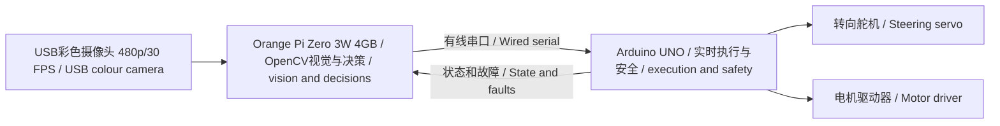

# Orange Pi Zero 3W车载视觉计算机 / Orange Pi Zero 3W Onboard Vision Computer

**当前配置：** Orange Pi是唯一感知计算平台，输入USB彩色摄像头，输出有线转向和速度目标。

**Current configuration:** The Orange Pi is the only perception computer. It receives USB colour-camera frames and outputs wired steering and speed targets.

## 1. 团队购买版本 / Team-Purchased Version

订单SKU为 **OPi Zero 3W 4G**，商品标题标注 **Orange Pi Zero 3W、全志A733混合八核**。它不是旧款H618四核Orange Pi Zero 3；本仓库一律以带字母W的Zero 3W为准。

The ordered SKU is **OPi Zero 3W 4G**, described as an **Orange Pi Zero 3W with an Allwinner A733 heterogeneous octa-core processor**. It is not the older H618 quad-core Orange Pi Zero 3; this repository consistently refers to the Zero 3W with the letter W.

商品链接 / Product link：<https://detail.tmall.com/item.htm?id=1044546976818>

| 项目 / Item | 团队版本或公开规格 / Team Version or Published Specification | 状态 / Status |
|---|---|---|
| 型号 / Model | Orange Pi Zero 3W | 订单确认 / Order confirmed |
| 内存 / Memory | 4 GB LPDDR5 | SKU确认，系统待验 / SKU confirmed; system pending |
| SoC | Allwinner A733 | 商品与公开资料一致 / Product and published data agree |
| CPU | 2× Cortex-A76 up to 2.0 GHz + 6× Cortex-A55 up to ~1.79 GHz | 公开规格，实机待验 / Published; hardware pending |
| 实时协处理器 / Real-time core | 1× XuanTie E902 RISC-V up to 200 MHz | 当前未使用 / Not currently used |
| GPU | Imagination BXM-4-64 MC1 | 当前OpenCV不依赖 / Current OpenCV does not depend on it |
| NPU | Up to 3 TOPS INT8 | 尚未证明调用 / Use not yet demonstrated |
| 存储 / Storage | microSD; optional eMMC/UFS pads | 系统盘待填写 / System storage pending |
| 摄像头接口 / Camera | 2× MIPI CSI; 本车使用USB/UVC / vehicle uses USB/UVC | 接口确认 / Interface confirmed |
| USB | USB 3.1 OTG Type-C + USB-C power | 转接方案待实机验证 / Hub setup pending |
| 显示 / Display | Mini HDMI 2.0, USB-C DP Alt | 比赛非必需 / Not required in competition |
| 扩展 / Expansion | 40Pin UART/I²C/SPI/PWM, PCIe 3.0 ×1 FPC | UART可用于底层通信 / UART may link controller |
| 无线 / Wireless | Wi-Fi 6, Bluetooth 5.4 | 比赛必须关闭 / Must be disabled in competition |
| 供电 / Power | USB-C 5 V/3 A | 独立稳压并实测 / Independent regulation and measurement |
| 尺寸质量 / Size and mass | 65×32 mm, ~14 g | 最终整车实测 / Measure final vehicle |

公开规格用于设计，不等于实车验证。最终应保存板卡照片、SKU截图、系统信息和供电测试。

Published specifications support design but are not equivalent to vehicle validation. Preserve board photographs, SKU screenshots, system information and power tests in the final record.

## 2. 车辆职责 / Vehicle Role

Orange Pi运行Linux，负责USB采集、广角去畸变、赛道判断、红绿识别、目标估计和转向/速度计算。Arduino接收有线命令、限制输出、控制舵机和电机并在通信超时时停车；当前无超声波和编码器输入。

The Orange Pi runs Linux and handles USB capture, wide-angle undistortion, track interpretation, red-green recognition, target estimation and steering/speed calculation. The Arduino receives wired commands, limits outputs, controls the servo and motor and stops on communication timeout; it receives no ultrasonic or encoder input.



Linux卡顿、掉帧或进程退出时，Arduino必须根据命令年龄停车。Orange Pi重启后不能自动行驶，必须重新通过底层 `WAIT_START` 状态。

If Linux stalls, frames drop or the process exits, the Arduino must stop based on command age. The vehicle must not move automatically after an Orange Pi restart; it must pass through the lower-level `WAIT_START` state again.

## 3. 通信协议与实现边界 / Communication Protocol and Implementation Boundary

使用有线USB串口或3.3 V UART，禁止无线控制。裸UART需要解决UNO 5 V与Orange Pi 3.3 V电平兼容，并共地。

Use wired USB serial or 3.3 V UART; wireless control is prohibited. A raw UART requires proper level compatibility between the UNO's 5 V logic and Orange Pi's 3.3 V logic, plus common ground.

### 3.1 当前已实现协议 / Currently Implemented Protocol

当前 `bev_segmentation.py` 以115200 baud约每50 ms发送一行ASCII命令，`VisionSerialExecutor.ino` 接收并验证：

The current `bev_segmentation.py` sends one ASCII command line at 115200 baud approximately every 50 ms, and `VisionSerialExecutor.ino` receives and validates it:

`steer,speed\n`

- `steer` 与 `speed` 都必须是 `-100...100` 的十进制整数 / Both fields must be decimal integers in `-100...100`.
- 格式错误、多余逗号、溢出或越界命令整帧丢弃 / Malformed, extra-comma, overflowing or out-of-range commands are discarded in full.
- Arduino只在 `VISION_DRIVE` 状态执行命令；上电为 `WAIT_START` / The Arduino executes commands only in `VISION_DRIVE` and powers up in `WAIT_START`.
- 连续250 ms未收到有效命令时电机归零、舵机回中并进入 `COMMS_FAILSAFE` / After 250 ms without a valid command, the motor is set to zero, steering is centred and `COMMS_FAILSAFE` is entered.
- 故障后必须再次按D8，并收到启动后的新命令，车辆才可恢复 / Recovery requires another D8 press and a fresh post-arm command.

该协议是当前代码的可复现基线，不包含序号、时间戳或CRC。测试编号U-01至U-10覆盖启动、解析、限幅和超时行为。

This protocol is the reproducible code baseline. It does not yet contain sequence numbers, timestamps or a CRC. Tests U-01 through U-10 cover start, parsing, limiting and timeout behaviour.

### 3.2 后续增强协议（尚未实现） / Future Hardened Protocol (Not Yet Implemented)

在完成当前基线的实车验证后，可评估带版本、序号、时间戳、状态和CRC的定长或CBOR帧。以下字段仅是设计候选，不能标记为当前比赛实现：

After the current baseline has passed vehicle testing, a fixed-length or CBOR frame with version, sequence, timestamp, state and CRC may be evaluated. The following fields are design candidates only and must not be presented as the current competition implementation:

高层命令候选 / Candidate high-level command:

`{seq, timestamp_ms, mode, target_speed, target_steer, obstacle_color, confidence, crc}`

底层回传候选 / Candidate lower-level feedback:

`{seq, state, command_age_ms, battery_mv, fault_bits, crc}`

- 序号递增，旧命令不重放 / Sequence numbers increase; stale commands are never replayed.
- 增强协议也必须保留不长于250 ms的底层停车上限；最终阈值由制动试验确认 / The hardened protocol must retain a lower-level stop limit no longer than 250 ms; braking tests must confirm the final threshold.
- 低置信度禁止激进绕障 / Low confidence prohibits aggressive avoidance.
- CRC失败、越界或过期帧整帧丢弃 / Discard frames with bad CRC, out-of-range fields or stale timestamps.
- Arduino本地安全优先于Orange Pi速度命令 / Arduino-local safety overrides Orange Pi speed commands.

## 4. 视觉算力 / Vision Compute Rationale

480p/30 FPS下，HSV、形态学、轮廓和简单几何可由CPU完成，4 GB内存足够传统视觉。3 TOPS NPU只是未来选项，未完成模型转换、板端运行、延迟和精度比较前不得声称已使用。

At 480p/30 FPS, HSV, morphology, contours and simple geometry can run on the CPU, and 4 GB is sufficient for traditional vision. The 3 TOPS NPU is only a future option and must not be claimed as used before model conversion, onboard execution, latency and accuracy comparisons are complete.

开发顺序 / Development order:

1. 完成UVC、去畸变、HSV和串口闭环 / Complete UVC, undistortion, HSV and serial closed-loop operation.
2. 测量延迟、CPU、温度、掉帧和30分钟稳定性 / Measure latency, CPU, temperature, frame drops and 30-minute stability.
3. 传统视觉不足时再评估NPU / Evaluate NPU only if traditional vision is insufficient.
4. 保留可回退CPU基线 / Preserve a fallback CPU baseline.

## 5. 供电、散热与安装 / Power, Cooling and Mounting

Orange Pi使用独立 **5 V/3 A USB-C** 稳压支路，不能从Arduino 5 V取电。连续能力不低于3 A，并为启动、摄像头和风扇留余量；记录待机、视觉和满负载电流。

Power the Orange Pi from an independent regulated **5 V/3 A USB-C** branch, never from Arduino 5 V. Provide at least 3 A continuous capacity plus margin for startup, camera and fan; record idle, vision and full-load current.

- 使用绝缘垫柱 / Use insulating standoffs.
- 固定USB-C和摄像头线，避开拉杆与传动轴 / Secure USB-C and camera cables away from links and driveshaft.
- 安装风扇并记录环境和SoC最高温度 / Install a fan and record ambient and peak SoC temperatures.
- 动力线与USB/串口分开 / Separate power wiring from USB/serial.
- 共地但大电流不走细信号地 / Share ground without routing high current through thin signal grounds.
- 总开关一次断电，不依赖软件关机 / Use a single main switch; do not depend on software shutdown.

## 6. 系统验收 / System Acceptance

保存以下命令结果 / Save the output of:

```bash
cat /proc/cpuinfo
free -h
uname -a
lsblk
lsusb
v4l2-ctl --list-devices
v4l2-ctl --list-formats-ext -d /dev/video0
ip link
rfkill list
```

还要记录镜像校验、内核、OpenCV、运行环境、自动启动服务、设备路径、冷启动/进程重启时间、峰值温度和5 V峰值电流。

Also record image checksum, kernel, OpenCV, runtime, autostart service, device paths, cold-start/process-restart time, peak temperature and peak 5 V current.

## 7. 无线合规 / Wireless Compliance

比赛程序不使用Wi-Fi 6或Bluetooth 5.4。上场前禁用服务或设备，使用 `ip link` 和 `rfkill list` 留证，确认无热点、配对或无线控制。日志通过有线或存储卡导出。

The competition program uses neither Wi-Fi 6 nor Bluetooth 5.4. Before a run, disable the services/devices and retain `ip link` and `rfkill list` evidence showing no hotspot, pairing or wireless control. Export logs by cable or storage card.

## 8. 来源与待核验 / Sources and Pending Verification

- 购买版本来自团队订单截图和商品链接，整理于2026-07-15 / Purchased version from the team order screenshot and product link, compiled 2026-07-15.
- Orange Pi产品索引 / Orange Pi product index：<https://www.orangepi.org/html/hardWare/computerAndMicrocontrollers/index.html>
- 接口和规格参考 / Interface and specification reference：<https://www.cnx-software.com/2026/04/15/orange-pi-zero-3w-an-allwinner-a733-sbc-in-raspberry-pi-zero-form-factor/>

仓库只确认4 GB SKU。eMMC、UFS、风扇、转接板和存储卡是否安装，以实物和系统枚举为准。比赛镜像必须冻结并备份。

Only the 4 GB SKU is confirmed. Whether eMMC, UFS, fan, adapter board and storage card are installed must be verified physically and by system enumeration. Freeze and back up the competition image.
