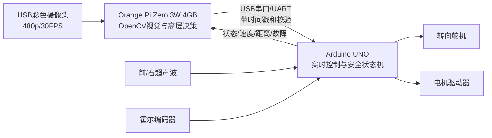

# Orange Pi Zero 3W 车载视觉计算机

## 1. 团队实际购买版本

团队订单截图显示购买 SKU 为 **OPi Zero 3W 4G**，商品标题标注 **Orange Pi Zero 3W、高性能混合八核、全志 A733**。该板与旧款 **Orange Pi Zero 3（H618、四核 Cortex-A53、LPDDR4）** 不是同一型号，仓库中的系统说明一律以带字母 **W** 的 Zero 3W 为准。

商品链接：<https://detail.tmall.com/item.htm?id=1044546976818>

| 项目 | 团队版本/公开规格 | 工程状态 |
|---|---|---|
| 型号 | Orange Pi Zero 3W | 订单截图已确认 |
| 内存版本 | 4 GB LPDDR5 | 订单 SKU 已确认；上车后用系统命令复核 |
| SoC | Allwinner A733 | 商品标题及公开资料一致 |
| CPU | 2× Cortex-A76，最高 2.0 GHz；6× Cortex-A55，最高约 1.79 GHz | 公开规格，待实机读取频率 |
| 实时协处理器 | 1× 玄铁 E902 RISC-V，最高 200 MHz | SoC 公开规格；当前方案未使用 |
| GPU | Imagination BXM-4-64 MC1 | 公开规格；当前 OpenCV 方案不依赖 GPU |
| NPU | 最高 3 TOPS INT8 | 商品图和公开规格；当前尚未证明已调用 NPU |
| 存储 | microSD；板上还预留 eMMC/UFS 选配位置 | 最终系统盘型号与容量待填写 |
| 摄像头接口 | 2× MIPI CSI；本车摄像头实际走 USB/UVC | 公开规格与团队摄像头接口 |
| USB | 1× USB 3.1 OTG Type-C（兼容 DP Alt）；1× USB-C 供电 | 公开规格；USB 摄像头所需转接方案待实机确认 |
| 显示 | Mini HDMI 2.0，最高 4K60；USB-C DP Alt；支持双显示 | 不属于比赛必需功能 |
| 扩展 | 40Pin GPIO（UART/I²C/SPI/PWM）、PCIe 3.0 ×1 FPC | UART 用于与底层控制器通信 |
| 无线 | 双频 Wi-Fi 6、Bluetooth 5.4 | **比赛时必须关闭，不用于控制或传输** |
| 标称供电 | USB-C 5 V / 3 A | 公开规格；必须使用独立稳压支路并实测峰值 |
| 板卡尺寸/质量 | 65 × 32 mm，约 14 g | 公开规格；整车尺寸以装配后实测为准 |

公开规格列用于设计和电源预算，不等于已经完成实车验证。最终技术文档应保存开发板正反面照片、包装/SKU 截图、系统信息截图和实际供电测试记录。

## 2. 在车辆中的职责

Orange Pi 运行 Linux，负责 USB 摄像头采集、广角去畸变、红绿障碍识别、目标位置估计以及高层行为决策。Arduino UNO（或最终确认的 ESP32）负责硬实时性更强的超声波、编码器、舵机、电机驱动和紧急停车。高层计算机不能直接绕过底层安全状态机驱动电机。



这种分层的优点是：Linux 短暂卡顿、摄像头掉帧或视觉进程退出时，Arduino 仍可根据命令超时和前方距离独立减速停车。Orange Pi 重启后不得自动让车辆运动，必须重新经过底层 `WAIT_START` 启动状态。

## 3. 通信协议建议

建议使用有线 USB 串口或 3.3 V UART，禁止通过 Wi-Fi 或蓝牙发送控制命令。若使用裸 UART，必须确认 UNO 5 V 逻辑与 Orange Pi 3.3 V 逻辑的电平兼容，必要时增加双向电平转换；两块控制器必须共地。

高层下发消息建议包含：

`{seq, timestamp_ms, mode, target_speed, target_steer, obstacle_color, confidence, crc}`

底层回传消息建议包含：

`{seq, state, front_cm, right_cm, wheel_speed, battery_mv, fault_bits, crc}`

安全约束：

- 命令序号必须递增，旧命令不得重新执行；
- 连续 200–300 ms 未收到有效命令时进入减速或停车，准确阈值通过实车制动试验确定；
- `confidence` 低于阈值时不得发出激进绕障命令；
- CRC/校验失败、字段越界或时间戳过旧时丢弃整帧；
- 紧急停车条件由 Arduino 本地判定，优先级高于 Orange Pi 的速度命令。

## 4. 视觉算力选型说明

团队摄像头的标称工作模式为 640×480、30 FPS 彩色。对这一分辨率，HSV 阈值、形态学处理、轮廓筛选和简单几何估计可先使用 CPU 完成，4 GB 内存足够容纳系统和传统视觉程序。A733 的 3 TOPS NPU 可作为后续轻量模型的加速选项，但在团队完成模型转换、板端运行、延迟测试和精度对比之前，文档不得声称比赛程序已经使用 NPU。

推荐开发顺序：

1. 先完成 UVC 采集、去畸变、HSV 红绿识别和串口闭环；
2. 测量端到端延迟、CPU 占用、温度、掉帧率和 30 分钟稳定性；
3. 只有传统视觉在实际光照下不能满足准确率时，再评估 NPU 模型；
4. 任一升级必须保留可回退的 CPU 基线版本。

## 5. 供电、散热与安装

Orange Pi 标称需要 **5 V / 3 A USB-C** 供电，不能从 Arduino 5 V 引脚取电。建议从总开关后的独立降压模块供电，降压模块连续输出能力不低于 3 A，并为启动瞬态、USB 摄像头和风扇留余量。最终选型仍需用功率计记录待机、视觉运行和满负载三种工况。

- 板卡安装在绝缘垫柱上，避免底面焊点接触金属层板；
- USB-C 和摄像头线缆做防松固定，并避开转向拉杆和传动轴；
- 使用 2Pin 风扇接口安装小型散热风扇，记录环境温度与 SoC 最高温度；
- 电机和舵机动力线与 USB/串口信号线分开走线；
- Orange Pi 与 Arduino 共地，但大电流回路不得穿过细信号地线；
- 断电必须由车辆总开关一次完成，不能依赖软件关机作为比赛安全手段。

## 6. 系统验收记录

装车后执行并保存下列结果到工程日志：

```bash
cat /proc/cpuinfo
free -h
uname -a
lsblk
lsusb
v4l2-ctl --list-devices
v4l2-ctl --list-formats-ext -d /dev/video0
ip link
rfkill list
```

还应记录：系统镜像名称与校验值、内核版本、OpenCV 版本、Python/C++ 运行环境、自动启动服务、摄像头设备路径、串口设备路径、冷启动时间、视觉进程重启时间、峰值温度和峰值 5 V 电流。

## 7. 比赛无线合规

Orange Pi 自带 Wi-Fi 6 和 Bluetooth 5.4，但比赛程序不使用无线通信。上场前同时采用软件和现场证据确认关闭：禁用 Wi-Fi/蓝牙服务或设备树/内核模块，执行 `ip link` 与 `rfkill list` 检查，确认没有热点、配对设备或无线控制程序。调试日志和视频通过赛前有线连接或取出存储卡导出。

## 8. 信息来源与待核验项

- 购买版本：团队提供的天猫订单截图与商品链接，整理日期 2026-07-15；
- A733、八核、3 TOPS、LPDDR5、Wi-Fi 6、Bluetooth 5.4、Mini HDMI 2.0 等：商品图、Orange Pi 官方产品索引和公开规格资料交叉核对；
- 完整接口、电源、尺寸资料参考：<https://www.cnx-software.com/2026/04/15/orange-pi-zero-3w-an-allwinner-a733-sbc-in-raspberry-pi-zero-form-factor/>；
- Orange Pi 产品索引：<https://www.orangepi.org/html/hardWare/computerAndMicrocontrollers/index.html>。

商品页可能包含多个内存和配件 SKU。仓库只把 **4 GB** 作为团队已购买配置；eMMC、UFS、风扇、转接板和存储卡是否随车安装，必须以实物照片和系统枚举为准。由于 Zero 3W 是 2026 年的新板，操作系统镜像、驱动和 NPU 工具链仍可能更新，最终比赛镜像应冻结版本并保留可恢复备份。
