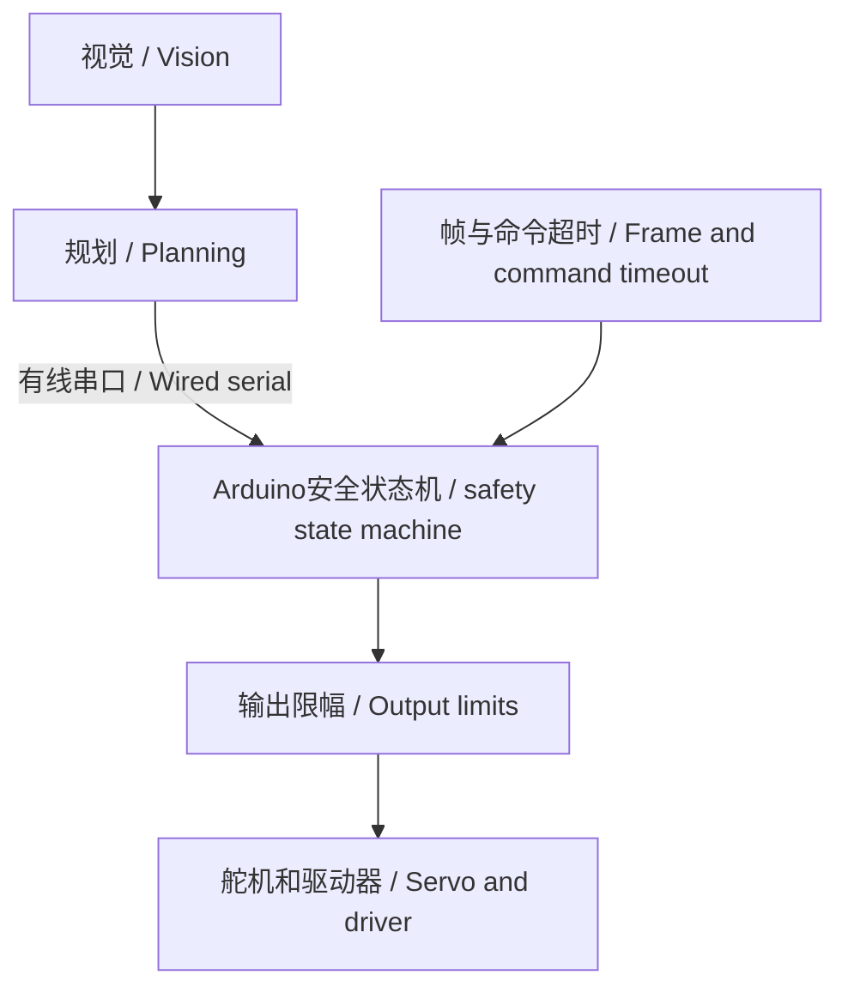
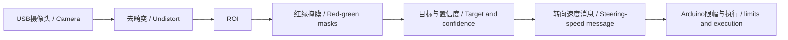

# 软件架构、状态机与控制算法 / Software Architecture, State Machine and Control Algorithms

**当前配置：** 摄像头和Orange Pi承担全部环境感知；Arduino只执行视觉命令并在超时时停车。

**Current configuration:** The camera and Orange Pi provide all environmental perception; the Arduino only executes vision-derived commands and stops on timeout.

## 1. 高低层分工 / High-Level and Low-Level Roles

Orange Pi运行Linux/OpenCV，判断赛道、红绿障碍、方向和目标轨迹。Arduino不采集超声波或编码器，只接收有线目标，限制输出、驱动舵机/电机并执行超时停车。Wi-Fi和蓝牙不参与比赛。

The Orange Pi runs Linux/OpenCV to interpret the track, red-green obstacles, direction and target path. The Arduino reads neither ultrasonic sensors nor encoders; it receives wired targets, limits outputs, drives the servo/motor and enforces timeout stopping. Wi-Fi and Bluetooth are not used in competition.

Orange Pi只提出目标，不直接写PWM。视觉退出、Linux卡顿、摄像头断开或串口失败时，Arduino必须停车；无独立距离传感器时不得继续最后命令。

The Orange Pi proposes targets but never writes PWM directly. If vision exits, Linux stalls, the camera disconnects or serial fails, the Arduino must stop; without an independent range sensor it must never continue the last command.

| 模块 / Module | 当前文件 / File | 已实现 / Implemented | 待完成 / Pending |
|---|---|---|---|
| 道路预处理 / Road preprocessing | `bev_road.py` | 亮度、实验BEV、掩膜、连通域 / Brightness, experimental BEV, masks, components | 实车透视标定 / Vehicle perspective calibration |
| 视觉规划 / Vision planning | `bev_segmentation.py` | 红绿HSV、道路密度、CW/CCW、恢复 / Red-green HSV, road density, CW/CCW, recovery | 停车、圈数、精度和稳定性 / Parking, laps, accuracy, stability |
| 通信 / Communication | `VehicleIO` | 约50 ms发送 `steer,speed` / Sends approximately every 50 ms | 序号、时间戳、CRC、应答 / Sequence, timestamp, CRC, acknowledgement |
| 底层 / Low level | `VisionSerialExecutor.ino` | D8启动/停止、文本解析、限幅、D2舵机、D6/D7电机、250 ms超时 / D8 start/stop, text parsing, limits, D2 servo, D6/D7 motor and 250 ms timeout | UNO实机编译、驱动器接口与车辆测试 / Actual-UNO build, driver interface and vehicle tests |

## 2. Arduino分层 / Arduino Layers

任务层决定等待、视觉驾驶或故障停车；控制层校验命令和时间并限幅；硬件层只读写舵机和驱动引脚。这样更换驱动器时无需改写视觉策略。

The task layer selects waiting, vision driving or fault stop; the control layer validates command age and limits outputs; the hardware layer only accesses servo and driver pins. This isolates driver changes from vision strategy.

## 3. 状态机 / State Machine

| 状态 / State | 进入 / Entry | 行为 / Action | 退出 / Exit |
|---|---|---|---|
| `WAIT_START` | 上电或行驶中按D8 / Power-up or D8 press while driving | 电机停、舵机中位，丢弃行驶命令 / Motor stopped, steering centred, motion commands discarded | D8启动 / D8 arm |
| `VISION_DRIVE` | D8启动 / D8 arm | 等待按键之后的新合法命令，再执行限幅目标 / Wait for a fresh valid post-arm command, then execute limited targets | D8停止或250 ms无合法命令 / D8 stop or 250 ms without valid command |
| `COMMS_FAILSAFE` | 命令超时 / Command timeout | 电机PWM=0、舵机回中，不自动恢复 / Motor PWM=0, steering centred, no automatic recovery | D8重新启动，再等待新命令 / D8 re-arm, then wait for a fresh command |

`VISION_RECOVERY` 是Orange Pi视觉策略内部状态，不是Arduino安全状态。这样高层可以改变恢复策略，但不能越过UNO的物理启动和命令年龄约束。

`VISION_RECOVERY` is an internal Orange Pi vision-strategy state, not an Arduino safety state. This lets the high level change its recovery strategy without bypassing the UNO physical-start and command-age constraints.

## 4. 历史算法参考 / Historical Algorithm References

编码器PI、超声波巡墙PD和 `pulseIn()` 处理只解释旧示例，当前车辆不运行。 / Encoder PI, ultrasonic wall-following PD and `pulseIn()` handling only explain old examples and do not run on the current vehicle.

- 速度PI / Speed PI：`PWM = Kp_v × e_v + Ki_v × ∫e_v dt`
- 巡墙PD / Wall-follow PD：`steer = Kp_d × e_d + Kd_d × (e_d - e_previous) / dt`
- 历史滤波 / Historical filter：`filtered = 0.65 × previous + 0.35 × sample`

## 5. 当前视觉数据流 / Current Vision Data Flow

视觉输出目标转向和速度，而不是PWM。当前协议没有源时间戳，因此UNO只依据最近合法收包时间执行250 ms本地超时。画面冻结、进程停止或串口中断时，不能维持最后运动命令。

Vision outputs target steering and speed, not PWM. The current protocol has no source timestamp, so the UNO enforces a 250 ms local timeout from the most recent valid line. If frames freeze, the process stops or serial communication breaks, it never holds the last motion command indefinitely.
