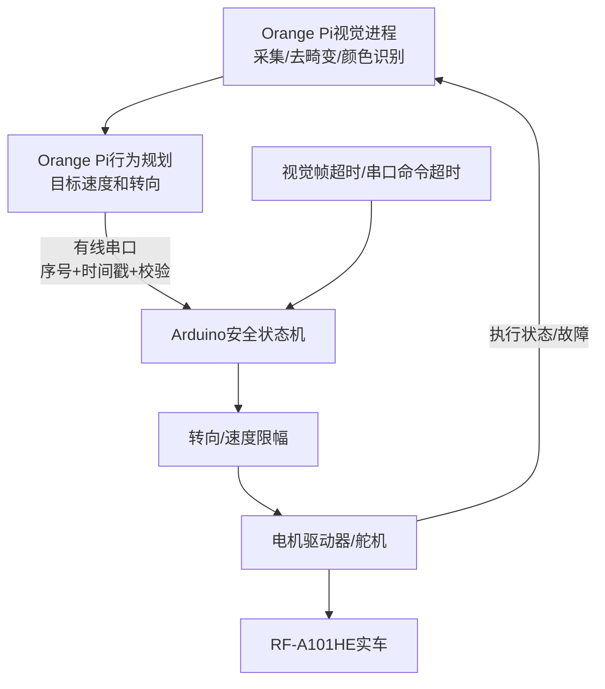
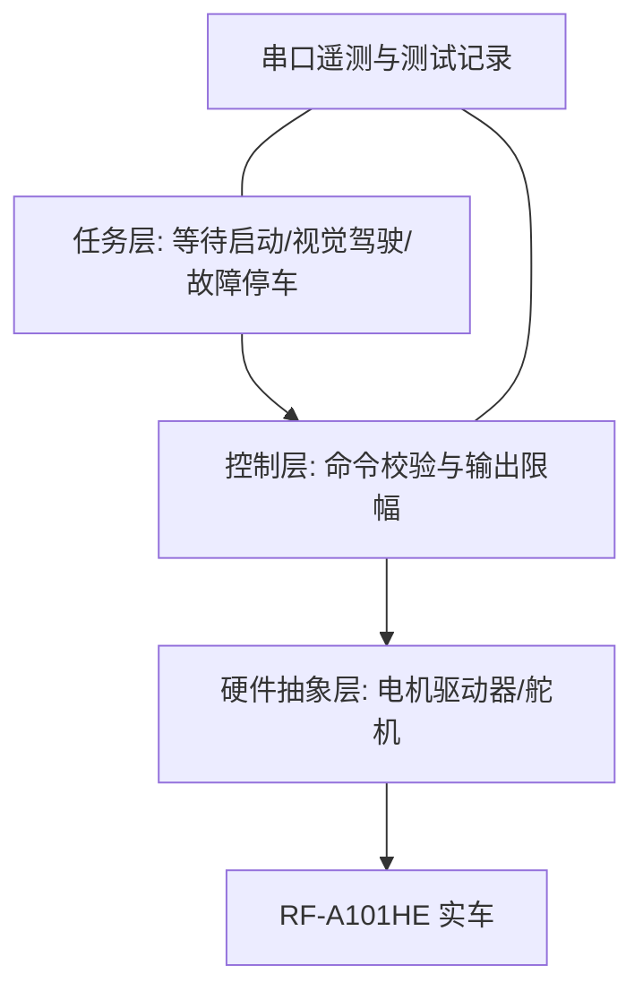

# 软件架构、状态机与控制算法

Software Architecture, State Machine and Control Algorithms

**当前配置 / Current configuration:** 摄像头和Orange Pi承担全部环境感知；Arduino只执行视觉命令并在命令超时时停车。The camera and Orange Pi provide all environmental perception. The Arduino only executes vision-derived commands and stops on command timeout.

## 1. 高层计算机与实时控制器分工

比赛系统采用 **Orange Pi Zero 3W + Arduino UNO** 两级架构，当前环境感知只使用USB摄像头。Orange Pi 运行 Linux/OpenCV，完成赛道、红绿障碍、方向和目标轨迹判断；Arduino不采集超声波或编码器，只接收有线串口的目标转向与速度，进行输出限幅、舵机/电机驱动和命令超时停车。Wi-Fi 和蓝牙不参与比赛运行。

安全原则：Orange Pi 只提出目标，不直接写 PWM；Arduino 始终保留输出限幅、命令超时和 `WAIT_START`。视觉进程退出、Linux 卡顿、USB 摄像头断开或串口校验失败时，Arduino必须在规定时间内把电机目标置零。由于当前没有独立距离传感器，视觉故障后不得继续直行。通信字段与实机验收见 `processor-orange-pi.md`。

### 当前代码与目标架构的对应关系

| 架构模块 | 当前文件 | 已实现 | 尚未实现/验证 |
|---|---|---|---|
| 道路预处理 | `src源代码/bev_road.py` | 亮度归一化、实验性映射、道路掩膜和连通域 | 实车地面四点透视标定 |
| 视觉与规划 | `src源代码/bev_segmentation.py` | 红绿HSV、道路密度、CW/CCW、恢复状态机 | 停车区、圈数、多光照精度和板端稳定性 |
| 有线通信 | `bev_segmentation.py` 的 `VehicleIO` | 约50 ms发送 `steer,speed`，接收CW/CCW | 序号、时间戳、CRC、应答和底层超时 |
| 底层执行 | 最终视觉串口Arduino程序待确认 | 目标功能为启动、命令解析、输出限幅和超时停车 | 当前仓库的超声波/编码器示例不是比赛程序 |

上方架构图中的“序号+时间戳+校验”和 `COMMS_FAILSAFE` 是正式比赛目标设计，当前简单文本串口尚未达到这一要求，不能把设计图误当作已完成代码。

## 2. Arduino 内部分层结构

硬件层只负责读写舵机和电机驱动引脚；控制层校验视觉目标、限制转向/速度并检查命令时间；任务层决定等待启动、执行视觉命令或故障停车。分层后更换驱动器时只需要修改电机输出函数，而不是重写视觉策略。

## 3. 状态机

| 状态 | 进入条件 | 行为 | 退出条件 |
|---|---|---|---|
| `WAIT_START` | 上电复位 | 电机停止、舵机回中 | 独立启动按钮按下 |
| `VISION_DRIVE` | 启动且持续收到有效视觉命令 | 执行受限幅的目标转向与速度 | 命令超时、视觉故障或人工停止 |
| `VISION_RECOVERY` | 视觉程序进入制动/恢复阶段 | 按视觉状态机要求停车或低速恢复 | 恢复完成或命令超时 |
| `COMMS_FAILSAFE` | Orange Pi 命令超时、校验失败或视觉故障 | 受控减速并停车 | 人工检查后重新启动 |
| `MANUAL_STOP` | 测试中按停止或关闭运行许可 | 电机停止、舵机回中 | 人工检查后再次启动 |

状态机比把所有判断写在同一个循环中更容易测试。每个状态都有明确入口、输出和退出条件，可以在串口中用状态编号复现故障发生时的行为。

## 4. 编码器速度 PI（保留参考，当前未使用）

当前车辆不接入编码器，不运行本节速度PI。以下公式仅解释仓库示例程序，不能写入当前比赛功能清单。

误差为 `e_v = v_target - v_measured`，控制输出为：

`PWM = Kp_v × e_v + Ki_v × ∫e_v dt`

积分项设有限幅，防止车辆被卡住时积分不断累积。PWM 同时设有首次测试上限和最小起步值。调试顺序为：先令 `Ki=0`，逐步增加 `Kp`；再增加较小 `Ki` 消除稳态误差。每组参数至少完成 3 次同条件测试。

## 5. 超声波巡墙 PD（保留参考，当前未使用）

当前车辆不安装右侧超声波，不运行本节巡墙PD。以下内容只用于理解早期代码。

右侧距离误差为 `e_d = d_right - d_target`。当距离大于目标值时车辆需要向右修正；距离小于目标值时向左修正。控制律：

`steer = Kp_d × e_d + Kd_d × (e_d - e_previous) / dt`

比例项决定纠偏强度，微分项抑制蛇形振荡。输出经过最大转向限幅，再映射到舵机物理安全角度。无有效右侧回波时暂时直行，这是可预测的降级行为；最终版本可根据连续无效次数进入减速或停车。

## 6. 超声波处理（保留参考，当前未使用）

程序使用 10 μs 触发脉冲与超时读取，并顺序触发两只传感器以减少串扰。超范围或无回波统一表示为 999 cm。有效样本使用一阶低通滤波：

`filtered = 0.65 × previous + 0.35 × sample`

滤波能降低随机抖动，但会产生延迟。因此紧急停车阈值需要通过最坏车速下的停车距离试验确认，不能只依据静态测距设定。

## 7. 示例代码的时间和阻塞风险（当前视觉方案无 `pulseIn()`）

`pulseIn()` 是阻塞函数，两个传感器都超时时可能占用约 50 ms，加上其他处理会使实际周期超过目标 50 ms。代码使用真实 `dt` 计算速度和微分，减小周期变化影响。若后续增加更多传感器或视觉处理，应改用非阻塞测距或分时调度。

## 8. 障碍赛视觉架构

当前障碍赛方案完全基于视觉，需要完成方向确认、颜色目标检测、障碍物相对位置估计、合规侧通过、丢失目标恢复、圈数统计和停车区状态。视觉模块输出颜色、置信度、横向偏差以及目标转向/速度。安全停车依靠视觉帧超时、串口命令超时、上电默认停止和人工停止；目前没有底层距离传感器作为独立保障。

建议视觉数据流：

视觉处理不直接写电机 PWM，而是输出目标转向与速度，由Arduino完成限幅和执行。因为摄像头是唯一感知来源，摄像头暂时丢帧、画面冻结、视觉进程停止或串口中断时，Arduino必须根据命令时间戳/超时停止电机，不能维持最后一条运动命令。
