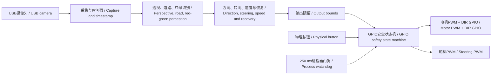
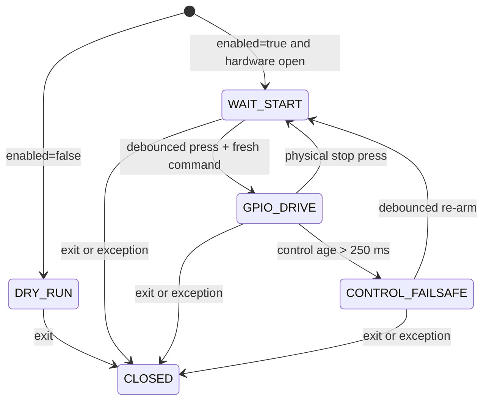

# 软件架构 / Software Architecture

> 当前版本由Orange Pi同时承担视觉、决策、安全状态和GPIO/PWM执行；Arduino只属于上一版本。 / The current version uses the Orange Pi for vision, decisions, safety state and GPIO/PWM execution; Arduino belongs only to the previous version.

## 1. 现行架构 / Current Architecture

Orange Pi不经过板间串口，直接使用内核GPIO/PWM接口。控制程序只产生逻辑转向和速度目标；`OrangePiGpioVehicle`负责硬件映射、限幅、物理授权、方向切换前归零、看门狗和安全释放。这样可以把所有危险输出集中到一个可审查模块。

The Orange Pi uses kernel GPIO/PWM interfaces directly, without an inter-board serial link. The controller produces only logical steering and speed targets; `OrangePiGpioVehicle` owns hardware mapping, limits, physical arming, zero-before-direction-change, watchdog behaviour and safe release. This centralises all hazardous outputs in one reviewable module.

## 2. 分层与接口 / Layers and Interfaces

| 层级 / Layer | 实现 / Implementation | 输入 / Input | 输出 / Output | 失效处理 / Failure Handling |
|---|---|---|---|---|
| 采集 / Capture | OpenCV/UVC | USB摄像头 / USB camera | 帧 + 单调时间 / Frame + monotonic time | 读取失败立即速度0 / Read failure immediately requests zero speed |
| 感知 / Perception | `bev_road.py`, `bev_segmentation.py` | 图像帧 / Image frame | 道路、边界、红绿障碍 / Road, border and red-green obstacles | 低置信度减速或停车 / Slow or stop on low confidence |
| 决策 / Decision | 方向与恢复状态机 / Direction and recovery state machine | 感知结果 / Perception result | `steer`, `speed` in `-100...100` | 制动动作先置速度0 / Braking actions set speed to zero first |
| 安全输出 / Safety output | `orange_pi_gpio.py` | 逻辑目标 + 按钮 / Logical targets + button | GPIO/PWM / GPIO/PWM | 默认停车、限幅、250 ms失效停车 / Stopped by default, bounded, 250 ms fail-safe |
| 清理 / Cleanup | `stop()` / `close()` | 退出、异常、中断 / Exit, exception, interrupt | PWM 0/禁用，舵机中位 / PWM zero/disabled, steering centred | 幂等执行 / Idempotent execution |

## 3. 配置与硬件抽象 / Configuration and Hardware Abstraction

`gpio_config.json`是本地实机文件并被Git忽略，模板为 `gpio_config.example.json`。模板的 `enabled=false` 且所有映射为 `-1`，因此克隆仓库后不会意外打开执行器。只有完成以下证据后才可启用：

`gpio_config.json` is a local hardware file ignored by Git; `gpio_config.example.json` is the template. The template uses `enabled=false` and `-1` for every mapping, so a fresh clone cannot accidentally activate actuators. Enable it only after collecting the following evidence:

1. 冻结的Orange Pi镜像、内核和设备树版本 / Frozen Orange Pi image, kernel and device-tree version.
2. `/dev/gpiochip*` 与 `/sys/class/pwm` 枚举 / GPIO-chip and PWM enumeration.
3. 物理排针对GPIO line及PWM chip/channel的签字映射 / Signed header-to-line and PWM mapping.
4. 驱动器3.3 V输入兼容性、舵机电源和共地核对 / Driver 3.3 V compatibility, servo supply and common-ground check.
5. 示波器或逻辑分析仪记录的频率、占空比、脉宽和失效停车时间 / Recorded frequency, duty, pulse width and fail-safe timing.

## 4. 安全状态机 / Safety State Machine

- `DRY_RUN`不打开GPIO/PWM，仅显示请求值。 / `DRY_RUN` opens no GPIO/PWM and only reports requested values.
- `WAIT_START`保持电机0、舵机中位，旧控制值不能触发运动。 / `WAIT_START` keeps zero motor and centred steering; stale targets cannot cause motion.
- `GPIO_DRIVE`只执行新鲜、有限幅的目标。 / `GPIO_DRIVE` executes only fresh, bounded targets.
- `CONTROL_FAILSAFE`在超过250 ms无更新后停车，并要求重新按键。 / `CONTROL_FAILSAFE` stops after over 250 ms without an update and requires re-arming.
- `CLOSED`禁用PWM并释放资源。 / `CLOSED` disables PWM and releases resources.

## 5. 时间与故障语义 / Timing and Fault Semantics

所有年龄判断使用单调时钟，避免系统时间调整造成误判。视觉读取失败、处理异常、控制循环停滞、物理停止和正常退出都必须把电机置零。方向GPIO改变前先把电机PWM置零，防止带扭矩反向。

All age checks use a monotonic clock so wall-clock changes cannot alter safety timing. Camera-read failure, processing exceptions, a stalled control loop, physical stop and normal exit must all set motor output to zero. Motor PWM is zeroed before changing the direction GPIO to avoid reversing under torque.

**残余风险：** 250 ms看门狗线程与视觉程序位于同一Orange Pi。它可覆盖控制循环停止或异常，但不能保证覆盖Linux内核、PWM子系统、供电或整板冻结。最终风险关闭需要实测故障注入，并决定是否增加独立硬件使能门、常闭急停或驱动器使能的硬件失效保护。

**Residual risk:** The 250 ms watchdog thread shares the Orange Pi with the vision program. It covers a stalled control loop or exception but cannot guarantee coverage of a Linux-kernel, PWM-subsystem, power or complete-board freeze. Closing this risk requires fault-injection testing and a decision on an independent hardware enable gate, normally-closed emergency stop or driver-enable fail-safe.

## 6. 上一版本边界 / Previous-Version Boundary

上一版使用Orange Pi通过文本串口向Arduino发送 `steer,speed`，并由Arduino输出舵机和电机信号。相关 `VisionSerialExecutor.ino`、D2/D6/D7/D8接线和串口配置只作为版本演进证据保留，不属于当前BOM、接线图、运行命令或测试验收。

The previous version sent `steer,speed` text from the Orange Pi to an Arduino, which drove steering and motor signals. Its `VisionSerialExecutor.ino`, D2/D6/D7/D8 wiring and serial configuration remain only as version-history evidence and are not part of the current BOM, wiring, run commands or acceptance tests.
