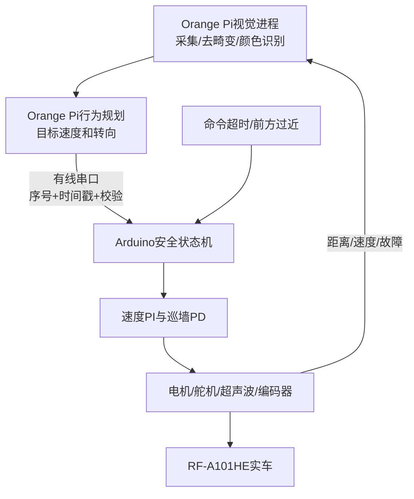
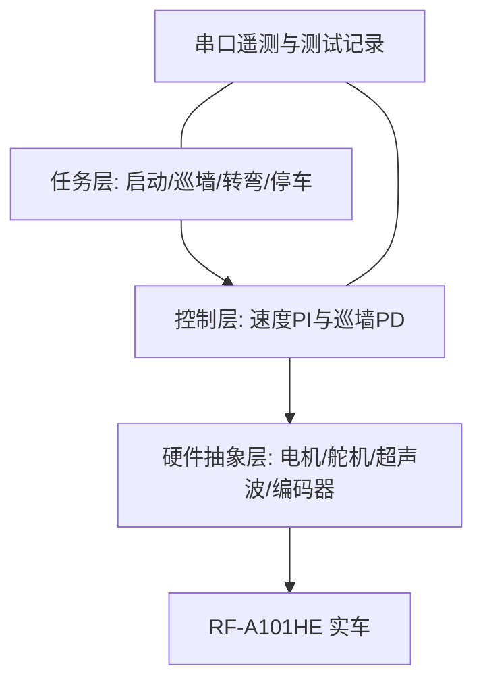
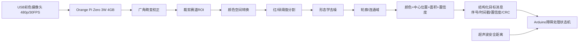

# 软件架构、状态机与控制算法

## 1. 高层计算机与实时控制器分工

比赛系统采用 **Orange Pi Zero 3W + Arduino UNO** 两级架构。Orange Pi 运行 Linux/OpenCV，处理 USB 摄像头、红绿障碍识别、赛道方向判断和目标轨迹；Arduino 运行确定性控制循环，采集超声波与编码器并控制舵机和电机。两者只通过有线串口交换结构化数据，Wi-Fi 和蓝牙不参与比赛运行。

安全原则：Orange Pi 只能提出目标，不直接写 PWM；Arduino 始终保留输出限幅、命令超时、前方紧急停车和 `WAIT_START`。视觉进程退出、Linux 卡顿、USB 摄像头断开或串口校验失败时，Arduino 在规定时间内减速停车。通信字段与实机验收见 `processor-orange-pi.md`。

### 当前代码与目标架构的对应关系

| 架构模块 | 当前文件 | 已实现 | 尚未实现/验证 |
|---|---|---|---|
| 道路预处理 | `src源代码/bev_road.py` | 亮度归一化、实验性映射、道路掩膜和连通域 | 实车地面四点透视标定 |
| 视觉与规划 | `src源代码/bev_segmentation.py` | 红绿HSV、道路密度、CW/CCW、恢复状态机 | 停车区、圈数、多光照精度和板端稳定性 |
| 有线通信 | `bev_segmentation.py` 的 `VehicleIO` | 约50 ms发送 `steer,speed`，接收CW/CCW | 序号、时间戳、CRC、应答和底层超时 |
| 底层控制 | 3个OpenChallenge Arduino/ESP32版本 | 启动、滤波、转弯、速度PI等基础结构 | 与Python协议的最终集成和实车验证 |

上方架构图中的“序号+时间戳+校验”和 `COMMS_FAILSAFE` 是正式比赛目标设计，当前简单文本串口尚未达到这一要求，不能把设计图误当作已完成代码。

## 2. Arduino 内部分层结构

硬件层只负责读写引脚；控制层把目标速度和距离误差转成执行器命令；任务层决定车辆当前应该巡墙、转弯还是停车。分层后更换驱动器时只需要修改电机输出函数，而不是重写整个任务逻辑。

## 3. 状态机

| 状态 | 进入条件 | 行为 | 退出条件 |
|---|---|---|---|
| `WAIT_START` | 上电复位 | 电机停止、舵机回中 | 独立启动按钮按下 |
| `FOLLOW_WALL` | 启动或转弯完成 | 右侧巡墙、速度闭环 | 前方进入转弯阈值 |
| `TURN_LEFT` | 前方墙面接近 | 降速并固定左转 | 计时满足且前方重新开阔 |
| `VISION_AVOID` | 收到有效红/绿目标且置信度达标 | 按规则选择通过侧并限速 | 已通过障碍或目标丢失超时 |
| `COMMS_FAILSAFE` | Orange Pi 命令超时、校验失败或视觉故障 | 受控减速并停车 | 人工检查后重新启动 |
| `EMERGENCY_STOP` | 前方过近或测试中按停止 | 电机停止、舵机回中 | 人工检查后再次按键 |

状态机比把所有判断写在同一个循环中更容易测试。每个状态都有明确入口、输出和退出条件，可以在串口中用状态编号复现故障发生时的行为。

## 4. 速度 PI 控制

误差为 `e_v = v_target - v_measured`，控制输出为：

`PWM = Kp_v × e_v + Ki_v × ∫e_v dt`

积分项设有限幅，防止车辆被卡住时积分不断累积。PWM 同时设有首次测试上限和最小起步值。调试顺序为：先令 `Ki=0`，逐步增加 `Kp`；再增加较小 `Ki` 消除稳态误差。每组参数至少完成 3 次同条件测试。

## 5. 巡墙 PD 控制

右侧距离误差为 `e_d = d_right - d_target`。当距离大于目标值时车辆需要向右修正；距离小于目标值时向左修正。控制律：

`steer = Kp_d × e_d + Kd_d × (e_d - e_previous) / dt`

比例项决定纠偏强度，微分项抑制蛇形振荡。输出经过最大转向限幅，再映射到舵机物理安全角度。无有效右侧回波时暂时直行，这是可预测的降级行为；最终版本可根据连续无效次数进入减速或停车。

## 6. 超声波处理

程序使用 10 μs 触发脉冲与超时读取，并顺序触发两只传感器以减少串扰。超范围或无回波统一表示为 999 cm。有效样本使用一阶低通滤波：

`filtered = 0.65 × previous + 0.35 × sample`

滤波能降低随机抖动，但会产生延迟。因此紧急停车阈值需要通过最坏车速下的停车距离试验确认，不能只依据静态测距设定。

## 7. 时间和阻塞风险

`pulseIn()` 是阻塞函数，两个传感器都超时时可能占用约 50 ms，加上其他处理会使实际周期超过目标 50 ms。代码使用真实 `dt` 计算速度和微分，减小周期变化影响。若后续增加更多传感器或视觉处理，应改用非阻塞测距或分时调度。

## 8. 障碍赛视觉架构

障碍赛应在现有状态机上增加：方向确认、颜色目标检测、障碍物相对位置估计、合规侧通过、丢失目标恢复、圈数统计和停车区状态。视觉模块只能输出结构化结果，例如颜色、置信度和横向偏差；安全停车仍应由底层距离传感器独立保障。

建议视觉数据流：

视觉处理不应直接写电机 PWM，而应输出目标颜色、目标中心横坐标、边界框面积和检测可信度，由任务状态机结合超声波决定是否绕行。这样摄像头暂时丢帧时，底层紧急停车仍保持独立。
