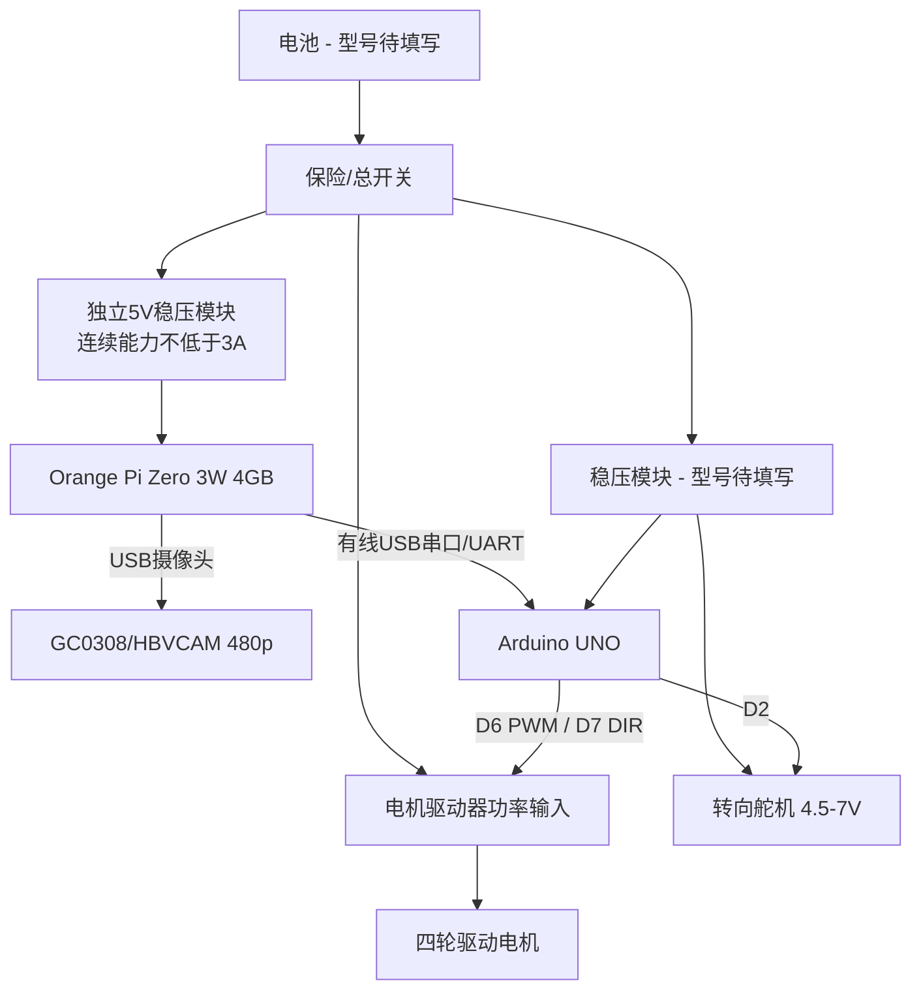

# 接线与供电说明 Wiring and Power

**当前配置 / Current configuration:** 当前环境感知只有USB摄像头；Orange Pi完成视觉，Arduino通过有线串口接收目标并驱动舵机和电机。The USB camera is the only environmental sensor. The Orange Pi performs vision, and the Arduino receives wired serial targets and drives the steering servo and motor. No ultrasonic or encoder signal is connected.

## 当前视觉方案的 Arduino UNO 引脚表

| 功能 | UNO 引脚 | 外设端 | 说明 |
|---|---:|---|---|
| 转向舵机 | D2 | S/黄色 | 舵机棕色接 GND，红色接合规 4.5-7 V 电源 |
| 电机速度 | D6 | PWM | PWM 调速 |
| 电机方向 | D7 | DIR | 高/低电平控制方向 |

当前车辆只使用视觉感知。D3、D4、D8、D9没有连接超声波，霍尔编码器A/B相也没有接入Arduino。仓库旧程序中的这些引脚定义仅供历史参考，不应照搬到当前比赛接线。

## Orange Pi 与 Arduino 连接

优先使用 Orange Pi USB-C OTG 经至少两个 Host 端口的可靠集线器同时连接 USB 摄像头和 Arduino USB 串口；该方式由 USB 接口处理逻辑电平。若改用 40Pin 裸 UART，Orange Pi GPIO 为 3.3 V 逻辑，不能把 UNO 的 5 V TX 直接接入 Orange Pi RX，必须增加合适的电平转换并交叉连接 TX/RX。两块控制器必须共地。

| 功能 | Orange Pi 端 | Arduino 端 | 说明 |
|---|---|---|---|
| 高层目标命令 | USB串口或3.3 V UART TX | USB或RX | 只传目标速度、转向和视觉结果 |
| 状态回传 | USB串口或3.3 V UART RX | USB或TX | 回传执行状态、命令超时和故障位 |
| 公共参考地 | GND | GND | 与整车控制地共地 |
| Orange Pi 电源 | USB-C 5 V/3 A | 不连接 UNO 5 V | 独立稳压支路供电 |

## 供电原则

1. 电池、电机驱动器、稳压模块、UNO、舵机和Orange Pi必须共地。
2. 驱动电机、舵机和 Orange Pi 不得直接从 UNO 5 V 引脚取大电流。
3. 舵机资料标明 VCC 4.5-7 V；最终供电电压须同时满足舵机实物标签和稳压模块额定值。
4. 电机电源接驱动器功率端，UNO 只输出 PWM/DIR 控制信号。
5. Orange Pi 按标称 5 V/3 A 使用独立稳压支路；3 A 是设计输入规格，典型/峰值电流仍需实测。
6. 首次上电前用万用表确认极性和各支路电压；首次测试时抬起驱动轮。

摄像头是当前唯一环境感知输入：`摄像头 → Orange Pi视觉 → 有线串口 → Arduino → 舵机/电机驱动器`。没有超声波或编码器反馈支路。

## 待补实物信息

- 电池型号、标称电压、容量和最大放电电流
- 稳压模块输入/输出电压及连续/峰值电流
- 电机驱动器型号和峰值电流
- 舵机型号、堵转电流和扭矩
- Orange Pi 5 V 稳压模块型号、效率、连续/峰值电流与散热
- Orange Pi 到摄像头/Arduino 的 USB-C OTG 转接线或集线器型号
- 总开关与独立启动按钮接法
- Orange Pi 与 Arduino 的最终串口设备、波特率和插头防松方式

最终提交时，应以绘图软件导出 PNG/PDF 电路图，并把本文件的“待补”项目替换为实测信息。

## 电源预算表

先填写规格书最大值，再用功率计记录典型值。稳压器连续额定值应高于典型总电流，峰值能力应覆盖电机启动与舵机堵转。

| 负载 | 电压 | 典型电流 | 峰值电流 | 数据来源 |
|---|---:|---:|---:|---|
| Arduino UNO | 5 V | 待测 | 待测 | 规格书+实测 |
| Orange Pi Zero 3W 4GB | 5 V | 待测 | 设计上限3 A | 公开供电规格+实测 |
| USB摄像头 | 5 V（USB） | 待测 | 待测 | 由Orange Pi USB支路供电 |
| 转向舵机 | 4.5-7 V | 400-800 mA | 堵转待测 | 标称10 kg·cm |
| 电机驱动逻辑 | 待核 | 待测 | 待测 | 驱动器规格书 |
| 驱动电机 | 6-12 V | 1.9 A额定 | 启动峰值待测 | 标称22.8 W |
| 总计 | - | 待计算 | 待计算 | - |

功率估算使用 `P=U×I`。电池理论运行时间只能用于比较：`t≈容量(Ah)/平均电流(A)`；实际时间会受到放电倍率、低压保护、温度和电机负载影响。

## 线束与抗干扰

- 电机动力线与USB摄像头、串口信号线尽量分开走线；
- 摄像头USB线和串口线应可靠固定并远离电机端子；
- 电机与舵机电流回路不要通过Orange Pi或串口细地线返回；
- 在驱动器和稳压器附近配置符合规格的去耦电容；
- 插头做防松与极性标记，线束保留转向活动余量；
- 任何滤波电容和保护器件都必须在最终电路图中标明。
