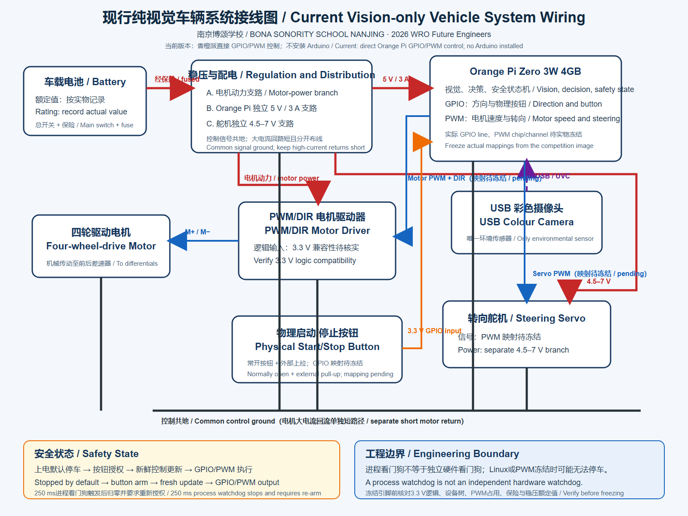
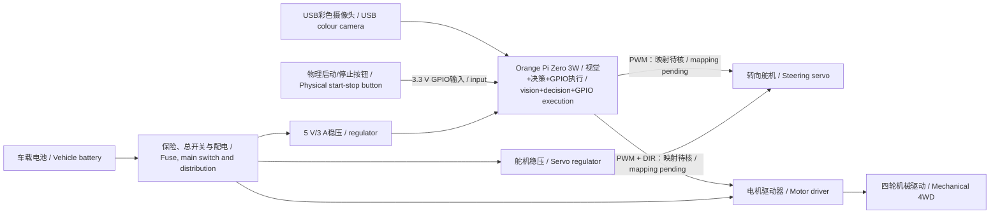

# Orange Pi GPIO直控接线与供电 / Orange Pi Direct-GPIO Wiring and Power

**当前配置：** USB彩色摄像头是唯一环境传感器。Orange Pi Zero 3W在同一车载计算平台上完成视觉、策略以及GPIO/PWM执行，直接控制转向舵机和电机驱动器。当前车辆不安装Arduino，不连接超声波，也不读取编码器。

**Current configuration:** The USB colour camera is the only environmental sensor. The Orange Pi Zero 3W performs vision, strategy and GPIO/PWM execution on the same onboard computer and directly controls the steering servo and motor driver. The current vehicle has no Arduino, ultrasonic sensor or encoder feedback.

## 1. 当前信号接口 / Current Signal Interfaces

GPIO line编号、PWM chip/channel和物理排针编号取决于最终Linux镜像、设备树配置和实际选用排针。团队尚未提供这些实测映射，因此下表明确保留待填字段，不编造针脚号。

GPIO line numbers, PWM chip/channels and physical header pins depend on the final Linux image, device-tree configuration and selected header pins. The team has not yet supplied this measured mapping, so the table keeps explicit pending fields rather than inventing pin numbers.

| 功能 / Function | Orange Pi资源 / Resource | 外设端 / Device Side | 电气与状态要求 / Electrical and State Requirement |
|---|---|---|---|
| 电机速度 / Motor speed | PWM chip/channel：待实机枚举 / Pending enumeration | 电机驱动器PWM / Driver PWM | 3.3 V逻辑必须兼容；默认占空比0 / Verify 3.3 V logic; default duty 0 |
| 电机方向 / Motor direction | `/dev/gpiochipN` line：待实机枚举 / Pending enumeration | 电机驱动器DIR / Driver DIR | 3.3 V输出；换向前PWM归零 / 3.3 V output; zero PWM before reversing |
| 转向舵机 / Steering servo | PWM chip/channel：待实机枚举 / Pending enumeration | 舵机信号 / Servo signal | 50 Hz；脉宽限位待架空标定 / 50 Hz; pulse limits require lifted calibration |
| 物理启动/停止 / Physical start/stop | `/dev/gpiochipN` line：待实机枚举 / Pending enumeration | 常开按钮到GND / Normally-open button to GND | 3.3 V外部上拉；按下为低 / External 3.3 V pull-up; active low |
| 摄像头 / Camera | USB/UVC | USB彩色摄像头 / USB colour camera | 固定插头并保存枚举 / Secure connector and save enumeration |
| 共地 / Common ground | Orange Pi GND | 驱动器、舵机电源和按钮GND / Driver, servo supply and button ground | 信号参考必须共地 / Common signal reference required |

实际映射填写到 [`gpio_config.json`](../src源代码/gpio_config.example.json) 的本地副本。仓库中的示例以 `enabled=false` 和 `-1` 占位，防止未核对针脚时意外输出。

Enter the verified mapping in a local copy named `gpio_config.json`, based on [`gpio_config.example.json`](../src源代码/gpio_config.example.json). The repository example uses `enabled=false` and `-1` placeholders to prevent output before pin verification.

## 2. 3.3 V逻辑与执行器隔离 / 3.3 V Logic and Actuator Isolation

Orange Pi GPIO只提供控制信号，不能直接为舵机、电机或驱动器功率级供电。必须逐项确认驱动器PWM/DIR输入和舵机信号端能可靠识别3.3 V；若阈值不兼容，应使用合适的缓冲或电平转换。任何外设都不得把5 V或更高电压反灌到Orange Pi GPIO。

Orange Pi GPIO supplies control signals only and must never power the servo, motor or driver power stage. Verify that driver PWM/DIR inputs and the servo signal input reliably accept 3.3 V. Use a suitable buffer or level shifter if thresholds are incompatible. No peripheral may feed 5 V or a higher voltage back into an Orange Pi GPIO.

- GPIO与PWM信号串联适当保护电阻，具体值根据边沿和驱动器输入实测 / Use suitable series protection resistors on GPIO/PWM signals, selected from measured edge and input behaviour.
- 启动按钮使用外部上拉到3.3 V，不上拉到5 V / Pull the start button up to 3.3 V externally, never to 5 V.
- 动力地回路短而粗，避免大电流经过Orange Pi细地线 / Keep power returns short and thick; do not route load current through a thin Orange Pi ground lead.
- 上电前用万用表检查每个信号对地电压 / Measure every signal-to-ground voltage before power-up.

## 3. 配电结构 / Power Distribution

| 支路 / Branch | 供电 / Supply | 负载 / Load | 要求 / Requirement |
|---|---|---|---|
| 主动力 / Main power | 最终电池，型号待核 / Final battery, model pending | 电机驱动器功率端 / Motor-driver power stage | 保险、总开关、线径按峰值电流选择 / Fuse, switch and wire gauge from measured peak |
| 计算与视觉 / Compute and vision | 独立稳压5 V/3 A / Independent regulated 5 V/3 A | Orange Pi + USB摄像头 / Orange Pi + USB camera | 记录启动、视觉和满负载最低电压 / Record minimum voltage at boot, vision and full load |
| 舵机 / Servo | 4.5-7 V合适稳压 / Suitable 4.5-7 V regulated branch | 转向舵机 / Steering servo | 不从Orange Pi排针取电；记录堵转峰值 / Do not power from Orange Pi header; record stall peak |
| 控制信号 / Control signals | Orange Pi 3.3 V逻辑 / Orange Pi 3.3 V logic | PWM、DIR和按钮 / PWM, DIR and button | 仅信号电流 / Signal current only |

总开关必须一次动作切断车辆驱动能量。Orange Pi正常关机流程与紧急断电是两件事；比赛安全不能依赖桌面操作或网络命令。

The main switch must remove vehicle drive energy in one action. Normal Orange Pi shutdown and emergency power removal are separate functions; competition safety must not depend on desktop interaction or a network command.

## 4. 正式系统图 / Formal System Diagram

[](system-wiring.png)

- [PNG接线图 / PNG wiring diagram](system-wiring.png)
- [SVG源文件 / SVG source](system-wiring.svg)



## 5. GPIO输出与安全状态 / GPIO Output and Safety States

当前程序是 [`orange_pi_gpio.py`](../src源代码/orange_pi_gpio.py)，由 [`bev_segmentation.py`](../src源代码/bev_segmentation.py)直接调用。状态如下：

The current output module is [`orange_pi_gpio.py`](../src源代码/orange_pi_gpio.py), called directly by [`bev_segmentation.py`](../src源代码/bev_segmentation.py). Its states are:

| 状态 / State | 进入条件 / Entry | 输出 / Output | 恢复 / Recovery |
|---|---|---|---|
| `DRY_RUN` | 配置不存在或 `enabled=false` / Missing config or disabled | 不打开GPIO/PWM，仅运行视觉 / No GPIO/PWM access; vision only | 核对映射后启用 / Enable after mapping verification |
| `WAIT_START` | 硬件初始化、人工停车 / Hardware initialisation or manual stop | 电机0、舵机中位 / Motor zero, steering centre | 物理按钮 / Physical button |
| `GPIO_DRIVE` | 物理按钮按下 / Physical button press | 执行最新受限视觉目标 / Apply latest limited vision target | 持续控制更新 / Continued control updates |
| `CONTROL_FAILSAFE` | 超过250 ms无控制更新 / No update for over 250 ms | 电机0、舵机中位 / Motor zero, steering centre | 必须再次按物理按钮 / Physical re-arm required |
| `CLOSED` | 程序正常或异常退出 / Normal or abnormal program exit | PWM禁用、资源关闭 / PWM disabled and resources closed | 重新启动完整程序 / Restart full program |

GPIO直控取消了串口和Arduino，但也取消了独立微控制器故障隔离。进程级看门狗线程不能替代硬件看门狗：如果Linux内核、PWM子系统或整个Orange Pi冻结，Python线程也可能无法执行停车。因此必须实测故障边界，并在最终安全评估中明确是否需要独立硬件使能门或电源级失效保护。

Direct GPIO control removes the serial link and Arduino, but also removes independent microcontroller fault isolation. A process-level watchdog thread is not a hardware watchdog: if the Linux kernel, PWM subsystem or entire Orange Pi freezes, Python may not execute the stop action. Test this boundary and explicitly decide whether an independent hardware enable gate or power-stage fail-safe is required.

## 6. 实机枚举与冻结 / Hardware Enumeration and Freeze

在最终镜像上保存以下输出，并把结果写入本页和证据登记表：

Save the following output on the final image and record the results here and in the evidence register:

```bash
gpiodetect
gpioinfo
ls -l /dev/gpiochip*
ls -l /sys/class/pwm
find /sys/class/pwm -maxdepth 2 -type f -print
```

还要保存物理排针照片，并建立“物理针脚 - SoC名称 - gpiochip/line或PWM chip/channel - 程序字段”四列映射。任何镜像或设备树变更后必须重新枚举。

Also preserve a physical-header photograph and a four-column mapping from physical pin to SoC name, gpiochip/line or PWM chip/channel, and configuration field. Re-enumerate after every image or device-tree change.

## 7. 上电检查 / Power-On Checklist

1. 驱动轮架空，总开关断开，确认接线和极性 / Lift drive wheels, keep the main switch off and verify wiring and polarity.
2. 不连接舵机和驱动器输入，先枚举GPIO/PWM并用示波器检查3.3 V、频率和默认低输出 / With actuators disconnected, enumerate GPIO/PWM and verify 3.3 V, frequency and safe defaults on an oscilloscope.
3. 复制示例配置，填写实测映射，保持 `enabled=false` 完成软件自检 / Copy the example, enter measured mappings and keep `enabled=false` for software self-test.
4. 接入驱动器但断开电机动力，确认方向、PWM和按钮逻辑 / Connect driver control with motor power removed; verify direction, PWM and button logic.
5. 接入舵机并架空标定中位、左右极限和峰值电流 / Connect the servo and calibrate centre, limits and peak current with wheels lifted.
6. 最后接电机动力，从低占空比测试并完成G-01至G-10 / Connect motor power last, begin at low duty and complete G-01 through G-10.

## 8. 上一版本边界 / Previous-Version Boundary

`VisionSerialExecutor.ino`、UNO D2/D6/D7/D8接线以及 `steer,speed` 串口协议属于上一版本。它们仅作为迭代记录保留，不得用于当前装车图、当前BOM或当前比赛配置说明。

`VisionSerialExecutor.ino`, UNO D2/D6/D7/D8 wiring and the `steer,speed` serial protocol belong to the previous version. They remain only as iteration history and must not appear in the current vehicle diagram, current BOM or current competition configuration.
