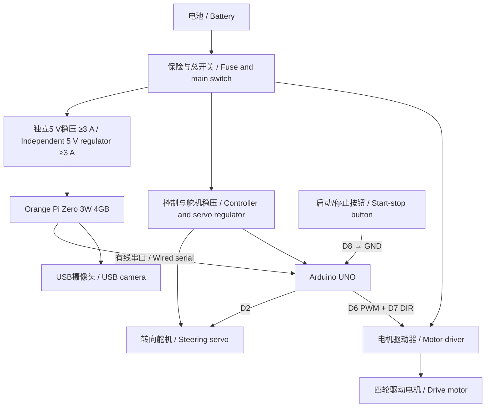

# 接线与供电说明 / Wiring and Power

**当前配置：** USB摄像头是唯一环境传感器。Orange Pi完成视觉，Arduino通过有线串口接收目标并驱动舵机和电机；不连接超声波或编码器。

**Current configuration:** The USB camera is the only environmental sensor. The Orange Pi performs vision, while the Arduino receives wired targets and drives the servo and motor. No ultrasonic or encoder signal is connected.

## Arduino UNO引脚 / Arduino UNO Pins

| 功能 / Function | UNO引脚 / Pin | 外设端 / Device Side | 说明 / Notes |
|---|---:|---|---|
| 转向舵机 / Steering servo | D2 | S / yellow | 棕色GND，红色4.5–7 V / Brown GND, red 4.5–7 V |
| 电机速度 / Motor speed | D6 | PWM | PWM调速 / PWM speed control |
| 电机方向 / Motor direction | D7 | DIR | 高低电平控制方向 / Logic level controls direction |
| 物理启动/停止 / Physical start/stop | D8 | 常开按钮到GND / Normally-open button to GND | `INPUT_PULLUP`，按下为LOW / Pressed = LOW |

D3、D4和D9不连接超声波，编码器A/B相也不接Arduino。旧程序中的这些定义仅供历史参考。D8只连接本地物理启动/停止按钮。

D3, D4 and D9 are not connected to ultrasonic sensors, and encoder A/B channels are not connected to the Arduino. Definitions in old programs are historical references only. D8 is used only for the local physical start/stop button.

当前候选底层程序为 [`VisionSerialExecutor.ino`](../src源代码/VisionSerialExecutor/VisionSerialExecutor.ino)。D2/D6/D7/D8是该程序和本图的一致候选引脚，必须在实车接线前核对驱动器接口和逻辑电平。此程序适用于PWM+DIR接口；若实物是双PWM接口，必须修改输出层、图纸和测试记录，不能直接混用。

The current candidate lower-level program is [`VisionSerialExecutor.ino`](../src源代码/VisionSerialExecutor/VisionSerialExecutor.ino). D2/D6/D7/D8 are the consistent candidate pins in that sketch and this drawing. Verify the actual driver interface and logic levels before wiring. The sketch targets a PWM+DIR interface; if the physical driver uses dual PWM, its output layer, drawing and test record must be changed rather than mixed directly.

## Orange Pi与Arduino / Orange Pi and Arduino

优先使用可靠USB-C OTG集线器同时连接USB摄像头和Arduino USB串口。若使用40Pin裸UART，Orange Pi为3.3 V逻辑，UNO的5 V TX不得直接接Orange Pi RX，必须使用电平转换并交叉连接TX/RX。两块控制器必须共地。

Prefer a reliable USB-C OTG hub to connect both the USB camera and Arduino USB serial. If using a raw 40-pin UART, the Orange Pi uses 3.3 V logic; never connect the UNO 5 V TX directly to Orange Pi RX. Use level conversion and cross-connect TX/RX. Both controllers require a common ground.

| 功能 / Function | Orange Pi端 / Side | Arduino端 / Side | 说明 / Notes |
|---|---|---|---|
| 高层命令 / High-level commands | USB serial or 3.3 V UART TX | USB or RX | 速度、转向、视觉结果 / Speed, steering and vision result |
| 状态回传 / Status feedback | USB serial or 3.3 V UART RX | USB or TX | 状态、超时和故障 / State, timeout and faults |
| 公共地 / Common ground | GND | GND | 与整车控制地相连 / Connected to vehicle control ground |
| Orange Pi电源 / Power | USB-C 5 V/3 A | 不接UNO 5 V / Do not connect UNO 5 V | 独立稳压 / Independent regulation |

## 供电原则 / Power Principles

1. 电池、驱动器、稳压模块、UNO、舵机和Orange Pi共地。 / Battery, driver, regulators, UNO, servo and Orange Pi share a common ground.
2. 电机、舵机和Orange Pi不得从UNO 5 V引脚取大电流。 / The motor, servo and Orange Pi must not draw high current from the UNO 5 V pin.
3. 舵机使用4.5–7 V，并以实物标签和稳压额定值为准。 / Supply the servo at 4.5–7 V, subject to the hardware label and regulator rating.
4. 电机电源接驱动器功率端；UNO只提供PWM/DIR。 / Motor power goes to the driver power stage; the UNO supplies only PWM/DIR.
5. Orange Pi使用独立5 V/3 A支路；典型和峰值电流仍需实测。 / The Orange Pi uses an independent 5 V/3 A branch; typical and peak current still require measurement.
6. 首次上电前检查极性和支路电压，并抬起驱动轮。 / Before first power-up, verify polarity and branch voltages and lift the drive wheels.

## 正式系统接线图 / Formal System Wiring Diagram

可编辑矢量源文件：[`system-wiring.svg`](system-wiring.svg)。图中任何“待核实”字段都必须根据实物标签、测量和接线照片闭环后，才能作为最终比赛图纸。

Editable vector source: [`system-wiring.svg`](system-wiring.svg). Every “verify” field in the diagram must be closed using the physical label, measurements and wiring photographs before the drawing is treated as final competition evidence.

信号链为“摄像头 → Orange Pi视觉 → 有线串口 → Arduino → 舵机/电机驱动器”，没有超声波或编码器反馈。

The signal chain is “camera → Orange Pi vision → wired serial → Arduino → servo/motor driver”, with no ultrasonic or encoder feedback.

## 待补实物信息 / Physical Information Still Required

- 电池型号、电压、容量和最大放电电流 / Battery model, voltage, capacity and maximum discharge current.
- 稳压模块输入输出和连续/峰值电流 / Regulator input/output and continuous/peak current.
- 电机驱动器型号与峰值电流 / Motor-driver model and peak current.
- 舵机型号、堵转电流和扭矩 / Servo model, stall current and torque.
- Orange Pi稳压器型号、效率、电流和散热 / Orange Pi regulator model, efficiency, current and cooling.
- OTG转接线或集线器型号 / OTG adapter or hub model.
- 总开关、启动按钮和最终串口参数 / Main switch, start button and final serial parameters.

当前已加入PNG/SVG系统接线图；最终提交前仍需用准确型号、额定值和实测值替换待补项目，并拍摄可追溯的实物线束照片。

A PNG/SVG system diagram is now included. Before final submission, replace all pending fields with exact models, ratings and measured values, and add traceable photographs of the physical harness.

## 串口与安全契约 / Serial and Safety Contract

Orange Pi每约50 ms发送一行 `steer,speed\n`，其中两项必须是 `-100...100` 的整数。Arduino忽略缺字段、多逗号、非数字、超范围和超长行；上电为 `WAIT_START`，按D8按钮后只接受按键之后的新合法命令。超过250 ms没有合法命令时，电机PWM归零、舵机回中并进入 `COMMS_FAILSAFE`；必须再次按物理按钮且收到新命令才能恢复。

The Orange Pi sends one `steer,speed\n` line approximately every 50 ms, with both fields as integers in `-100...100`. The Arduino ignores missing fields, extra commas, non-numeric values, out-of-range values and overlong lines. It powers up in `WAIT_START` and, after the D8 button is pressed, accepts only a fresh valid command received after the press. More than 250 ms without a valid command sets motor PWM to zero, centres steering and enters `COMMS_FAILSAFE`; another physical press and a fresh command are required for recovery.

## 电源预算 / Power Budget

| 负载 / Load | 电压 / Voltage | 典型电流 / Typical | 峰值电流 / Peak | 来源 / Source |
|---|---:|---:|---:|---|
| Arduino UNO | 5 V | 待测 / TBD | 待测 / TBD | 规格书+实测 / Datasheet + measurement |
| Orange Pi Zero 3W 4GB | 5 V | 待测 / TBD | 设计上限3 A / 3 A design limit | 公开规格+实测 / Published spec + measurement |
| USB摄像头 / Camera | 5 V USB | 待测 / TBD | 待测 / TBD | Orange Pi USB支路 / Orange Pi USB branch |
| 转向舵机 / Servo | 4.5–7 V | 400–800 mA | 堵转待测 / Stall TBD | 标称10 kg·cm / Rated 10 kg·cm |
| 驱动逻辑 / Driver logic | 待核 / TBD | 待测 / TBD | 待测 / TBD | 驱动器规格 / Driver datasheet |
| 驱动电机 / Motor | 6–12 V | 1.9 A rated | 启动待测 / Start TBD | 22.8 W rated |
| 总计 / Total | — | 待计算 / TBD | 待计算 / TBD | — |

功率使用 `P=U×I`。理论运行时间 `t≈容量(Ah)/平均电流(A)` 只用于比较，实际值受放电倍率、保护、温度和负载影响。

Use `P=U×I` for power. The theoretical runtime `t≈capacity(Ah)/average current(A)` is only comparative; actual runtime depends on discharge rate, protection, temperature and load.

## 线束与抗干扰 / Wiring and Interference Control

- 电机动力线与USB、串口分开走线 / Separate motor-power wiring from USB and serial lines.
- 固定USB和串口插头并远离电机端子 / Secure USB and serial plugs away from motor terminals.
- 大电流回路不得通过细信号地线 / Keep high-current returns out of thin signal grounds.
- 按规格在驱动器和稳压器附近去耦 / Add specified decoupling near drivers and regulators.
- 标记极性并为转向保留活动余量 / Mark polarity and leave movement allowance for steering.
- 在最终电路图标明滤波和保护器件 / Show all filtering and protection devices in the final circuit diagram.
