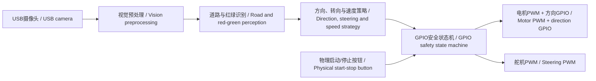

# 程序说明 / Source Code Guide

> 本文所有内容均为中英直接对照。 / All content is presented in direct Chinese-English pairs.

**现行方案：** `bev_road.py`负责道路/鸟瞰调试，`bev_segmentation.py`负责摄像头、赛道与红绿障碍识别、方向策略和控制循环，`orange_pi_gpio.py`在Orange Pi上直接执行GPIO/PWM输出。当前车辆不安装Arduino，不使用板间串口，不连接超声波，也不读取编码器。

**Current approach:** `bev_road.py` provides road and bird's-eye-view debugging, `bev_segmentation.py` handles the camera, track and red-green obstacle perception, direction strategy and control loop, and `orange_pi_gpio.py` directly executes GPIO/PWM outputs on the Orange Pi. The current vehicle has no Arduino, inter-board serial link, ultrasonic sensors or encoder readings.

## 1. 文件地图 / File Map

| 文件 / File | 平台 / Platform | 功能 / Function | 当前状态 / Current Status |
|---|---|---|---|
| [`bev_road.py`](bev_road.py) | Orange Pi / Python | 亮度、BEV、道路掩膜、连通域和调试图 / Brightness, BEV, road mask, connected components and debug views | 语法通过；透视点待实车标定 / Syntax passed; perspective points require calibration |
| [`bev_segmentation.py`](bev_segmentation.py) | Orange Pi / Python | 红绿识别、方向策略、恢复、仪表板和控制循环 / Red-green detection, direction strategy, recovery, dashboard and control loop | 语法通过；板端与实车待验证 / Syntax passed; board and vehicle tests pending |
| [`orange_pi_gpio.py`](orange_pi_gpio.py) | Orange Pi / Python | GPIO按钮与方向、PWM速度与舵机、状态机和看门狗 / GPIO button and direction, PWM speed and steering, state machine and watchdog | 语法通过；真实映射和波形待验证 / Syntax passed; real mapping and waveforms pending |
| [`gpio_config.example.json`](gpio_config.example.json) | Orange Pi | 默认禁用的GPIO/PWM配置模板 / Disabled-by-default GPIO/PWM configuration template | 所有硬件映射为 `-1`，防止误动作 / All hardware mappings are `-1` to prevent unintended motion |
| [`requirements.txt`](requirements.txt) | Orange Pi | NumPy、OpenCV和python-periphery依赖 / NumPy, OpenCV and python-periphery dependencies | 安装后需冻结实机版本 / Freeze actual installed versions |

## 2. 上一版本与历史实验 / Previous Version and Historical Experiments

下列程序不属于当前装车配置。它们保留用于证明团队迭代过程、底盘方向验证以及控制方案取舍，不得按当前比赛执行链连接或运行。

The following programs are not part of the current vehicle configuration. They are retained to document team iteration, early chassis-direction tests and control trade-offs, and must not be wired or run as the current competition execution chain.

| 文件 / File | 历史用途 / Historical Purpose | 当前边界 / Current Boundary |
|---|---|---|
| [`VisionSerialExecutor.ino`](VisionSerialExecutor/VisionSerialExecutor.ino) | 上一版Arduino串口安全执行 / Previous Arduino serial safety executor | 当前不安装Arduino、不使用串口 / No Arduino or serial link currently |
| [`serial_config.example.json`](serial_config.example.json) | 上一版Orange Pi到Arduino串口配置 / Previous Orange Pi-to-Arduino serial configuration | 历史记录，不被现行程序读取 / Historical record, not read by the current program |
| [`main1.0.ino`](main1.0/main1.0.ino) | 早期双超声波巡墙 / Early dual-ultrasonic wall following | 当前不连接超声波 / Ultrasonic sensors are not connected |
| [`UNO_AT8236`](UNO_AT8236_OpenChallenge/UNO_AT8236_OpenChallenge.ino) | 双PWM、编码器PI与超声波实验 / Dual-PWM, encoder PI and ultrasonic experiment | 历史实验 / Historical experiment |
| [`UNO_DRV8701`](UNO_DRV8701_OpenChallenge/UNO_DRV8701_OpenChallenge.ino) | PWM/DIR、编码器PI与超声波实验 / PWM/DIR, encoder PI and ultrasonic experiment | 历史实验 / Historical experiment |
| [`ESP32_AT8236`](ESP32_AT8236_OpenChallenge/ESP32_AT8236_OpenChallenge.ino) | ESP32电机与编码器实验 / ESP32 motor and encoder experiment | 历史实验；比赛无线关闭 / Historical experiment; radios disabled in competition |

双PWM与PWM/DIR驱动接口不同，不得混用接线或程序。当前 `orange_pi_gpio.py` 按PWM/DIR接口设计；连接前仍需核实实物驱动器接口、有效电平和3.3 V兼容性。

Dual-PWM and PWM/DIR driver interfaces are different and their wiring or code must never be mixed. The current `orange_pi_gpio.py` targets a PWM/DIR interface; verify the physical driver interface, active levels and 3.3 V compatibility before connection.

## 3. 当前软件数据流 / Current Software Data Flow



视觉控制器给输出层的是逻辑转向量 `-100...100` 与速度量 `-100...100`。输出层完成限幅、方向变化前归零、舵机脉宽换算、物理授权和超时停车。视觉算法不直接散落写GPIO，所有硬件访问集中在 `OrangePiGpioVehicle`。

The vision controller gives the output layer logical steering and speed values in `-100...100`. The output layer performs limits, zero-before-direction-change, steering pulse conversion, physical arming and timeout stopping. GPIO writes are not scattered through vision code; all hardware access is centralised in `OrangePiGpioVehicle`.

## 4. GPIO/PWM配置 / GPIO/PWM Configuration

复制配置模板，但在核验之前保持 `enabled=false`：

Copy the template while keeping `enabled=false` until verification:

```text
gpio_config.example.json -> gpio_config.json
```

需要填写并签字确认的字段如下。仓库故意不提供猜测的引脚号，因为Orange Pi的物理针脚编号、SoC line编号、设备树复用和 `/dev/gpiochipN` line编号不是同一套编号。

The following fields require entry and sign-off. The repository intentionally does not provide guessed pin numbers because Orange Pi physical-header numbers, SoC line numbers, device-tree multiplexing and `/dev/gpiochipN` line numbers are different numbering systems.

| 字段 / Field | 用途 / Purpose | 冻结依据 / Freeze Evidence |
|---|---|---|
| `gpiochip` + `motor_dir_line` | 电机方向GPIO / Motor-direction GPIO | `gpiodetect`、`gpioinfo`、排针对照 / enumeration and header mapping |
| `start_line` | 物理启动/停止输入 / Physical start-stop input | 外部上拉、常开按钮与实测有效电平 / external pull-up, NO button and measured active level |
| `motor_pwm_chip/channel` | 电机速度PWM / Motor-speed PWM | 设备树、`/sys/class/pwm` 与示波器波形 / device tree, sysfs enumeration and oscilloscope waveform |
| `servo_pwm_chip/channel` | 转向舵机PWM / Steering PWM | 设备树、通道占用与舵机脉宽 / device tree, channel ownership and servo pulse width |
| `servo_min/center/max_us` | 舵机安全范围 / Safe steering range | 架空机械极限和预留余量 / lifted-wheel mechanical limits and margin |
| `watchdog_ms` | 控制更新失效停车 / Stale-control stop | G-05实测时间 / measured G-05 timing |

建议枚举命令 / Recommended enumeration commands:

```bash
gpiodetect
gpioinfo
ls -l /dev/gpiochip*
find /sys/class/pwm -maxdepth 3 -type f -o -type l
```

## 5. 安装与运行 / Installation and Running

安装依赖并记录Orange Pi系统镜像、内核、Python、OpenCV、NumPy和python-periphery版本。实际比赛环境应在联网准备阶段完成安装，比赛运行时关闭Wi-Fi和蓝牙。

Install dependencies and record the Orange Pi image, kernel, Python, OpenCV, NumPy and python-periphery versions. Complete installation during connected preparation, then disable Wi-Fi and Bluetooth for competition operation.

```bash
python3 -m pip install -r requirements.txt
python3 bev_road.py
python3 bev_segmentation.py --video-in 0 --mode cw --gpio-config gpio_config.json
```

首次运行必须使用 `enabled=false`。此时状态为 `DRY_RUN`，不打开GPIO/PWM，只显示和记录请求值。完成映射、电气兼容、抬轮与波形检查后，才可将 `enabled` 改为 `true`。

The first run must use `enabled=false`. The state is then `DRY_RUN`: no GPIO/PWM is opened, and requested values are only displayed and logged. Set `enabled` to `true` only after mapping, electrical compatibility, lifted-wheel and waveform checks.

## 6. 安全状态机 / Safety State Machine

| 状态 / State | 进入条件 / Entry | 电机 / Motor | 舵机 / Steering | 退出条件 / Exit |
|---|---|---|---|---|
| `DRY_RUN` | `enabled=false` | 无硬件输出 / No hardware output | 无硬件输出 / No hardware output | 填写配置并人工启用 / Configure and enable manually |
| `WAIT_START` | 硬件打开或人工停车 / Hardware opened or manual stop | 0 | 中位 / Centre | 去抖后的物理按键 / Debounced physical press |
| `GPIO_DRIVE` | 已授权且收到新鲜控制更新 / Armed with fresh control update | 受限PWM / Limited PWM | 受限脉宽 / Limited pulse width | 按键、超时或异常 / Button, timeout or exception |
| `CONTROL_FAILSAFE` | 超过250 ms无新控制更新 / No fresh update for over 250 ms | 0 | 中位 / Centre | 必须重新按键 / Physical re-arm required |
| `CLOSED` | 正常退出或异常清理 / Normal exit or exception cleanup | PWM禁用并清零 / PWM zero and disabled | PWM禁用并释放 / PWM disabled and released | 重新启动程序 / Restart process |

方向变化前先把电机占空比置零，避免在有扭矩时反向。任何配置错误、初始化失败、摄像头丢失、控制异常、键盘中断或程序退出都必须走安全清理路径。

Motor duty is set to zero before direction changes to avoid reversing under torque. Configuration errors, initialisation failures, camera loss, control exceptions, keyboard interrupts and process exit must all use the safe cleanup path.

**重要边界：** 250 ms看门狗是同一Linux进程中的线程，不是独立硬件看门狗。如果Linux内核、PWM子系统或整块Orange Pi冻结，该线程也可能无法停车。必须实测这一残余风险，并决定是否增加独立硬件使能门或电源级失效保护。

**Important boundary:** The 250 ms watchdog is a thread in the same Linux process, not an independent hardware watchdog. If the Linux kernel, PWM subsystem or whole Orange Pi freezes, that thread may also fail to stop the vehicle. Test this residual risk and decide whether an independent hardware enable gate or power-stage fail-safe is required.

## 7. 必做验证 / Required Verification

1. `G-01`：`enabled=false`运行，确认未打开任何GPIO/PWM。 / Run with `enabled=false`; confirm no GPIO/PWM is opened.
2. `G-02`：硬件启用并上电，确认保持 `WAIT_START`、电机0、舵机中位。 / Enable hardware and power up; confirm `WAIT_START`, zero motor and centred steering.
3. `G-03`：按键授权但不发送新控制，确认不运动并进入失效状态。 / Arm without a fresh control update; confirm no motion and fail-safe entry.
4. `G-04`：输入边界与越界值，确认软件限幅和实际波形。 / Apply boundary and out-of-range values; verify limits and waveforms.
5. `G-05`：停止控制更新，测量从最后更新到电机PWM归零的时间。 / Stop control updates and measure time from the last update to zero motor PWM.
6. `G-06`：看门狗后发送新值，确认不自动恢复，必须重新按键。 / Send a new value after timeout; confirm no automatic recovery without re-arming.
7. `G-07`：运动中按键，确认立即停车。 / Press the button while moving; confirm immediate stop.
8. `G-08`：拔摄像头或停止视觉，确认停车。 / Disconnect the camera or stop vision; confirm stopping.
9. `G-09`：异常与进程退出，确认PWM归零/禁用且资源释放。 / Trigger an exception and process exit; confirm PWM zero/disable and resource release.
10. `G-10`：重复上电与正反向切换至少5次，确认方向变化前PWM先归零。 / Repeat power cycles and direction changes at least five times; confirm PWM is zero before direction reversal.

详细表格见 [`../other其他/tests.md`](../other其他/tests.md)，最终接线见 [`../schemes原理图/wiring.md`](../schemes原理图/wiring.md)。

See [`../other其他/tests.md`](../other其他/tests.md) for detailed records and [`../schemes原理图/wiring.md`](../schemes原理图/wiring.md) for final wiring.
