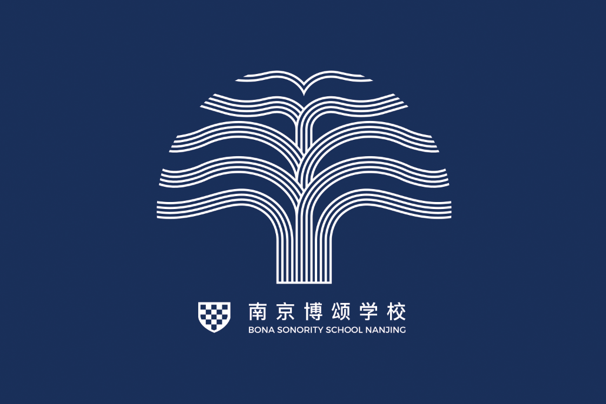
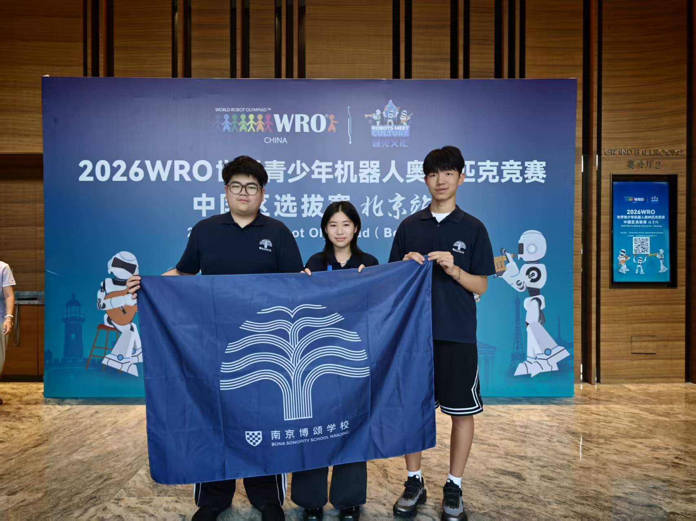
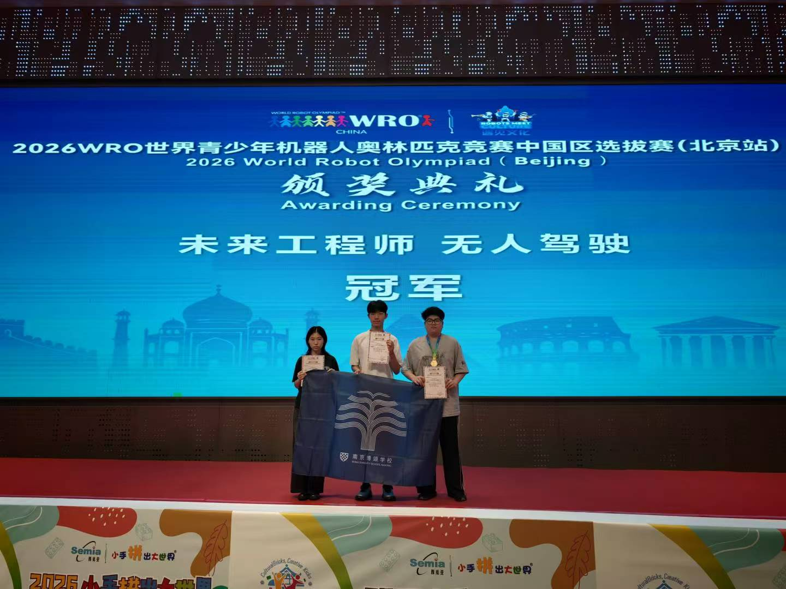
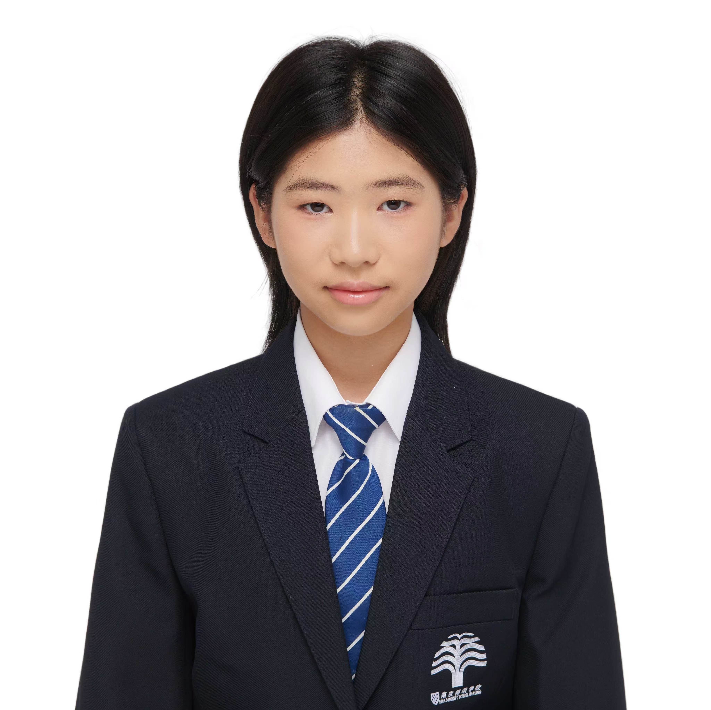
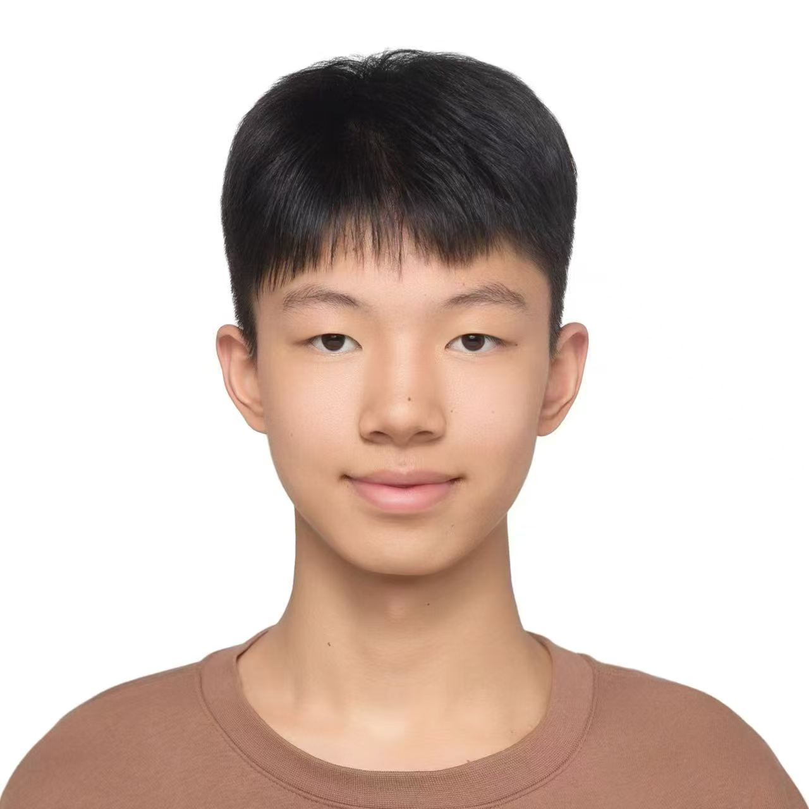
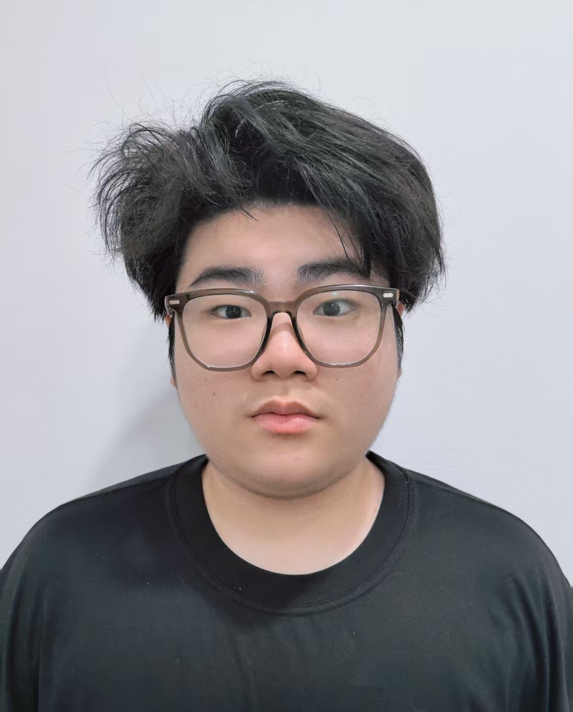
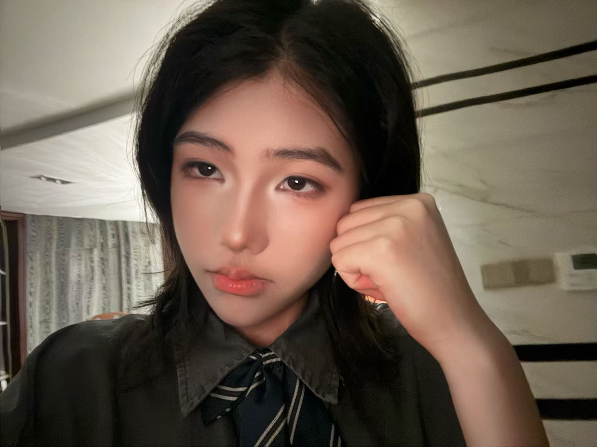
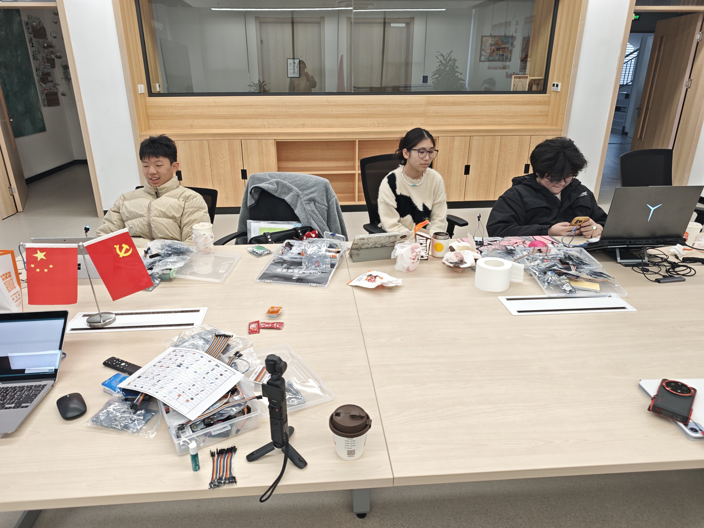

# 团队、赛事成果与制作过程照片 / Team, Competition and Development Photographs

本目录记录南京博颂学校 WRO Future Engineers 队伍的正式团队照、2026 WRO中国区选拔赛（北京站）冠军领奖照，以及控制器装配、接线、编程、讨论和调试阶段的真实制作过程。11张过程照片统一使用 `making-process-XX-内容.jpg` 命名，便于裁判从仓库首页直接查看并追溯研发过程。

This folder contains the official team photograph, the 2026 WRO China Qualification Tournament (Beijing) championship photograph and eleven authentic development-process photographs covering assembly, wiring, programming, discussion and testing.

## 学校队旗 / School Flag

- 学校 / School：南京博颂学校 / **BONA SONORITY SCHOOL NANJING**
- 完整团队介绍 / Full team profile：[`other其他/team-profile.md`](../other其他/team-profile.md)

## 团队与赛事成果 / Team and Competition Results

| 内容 Content | 文件 File | 状态 Status |
|---|---|---|
| 正式团队照：三名队员与校旗合影 / Official photograph of all three members with the school flag | [`team-official.jpg`](team-official.jpg) | 已完成 / Complete |
| 北京站未来工程师无人驾驶冠军领奖照 / Beijing Future Engineers Autonomous Driving championship photograph | [`award-beijing-champion.jpg`](award-beijing-champion.jpg) | 已完成 / Complete |
| 陆昭颖正式成员照 / Formal portrait of Lu Zhaoying | [`陆昭颖.jpg`](陆昭颖.jpg) | 已完成 / Complete |
| 陆昭颖形象照 / Additional portrait of Lu Zhaoying | [`陆昭颖形象照.jpg`](陆昭颖形象照.jpg) | 已完成 / Complete |
| 张隽泽正式成员照 / Formal portrait of Zhang Junze | [`张隽泽.jpg`](张隽泽.jpg) | 已完成 / Complete |
| 黄鸣博正式成员照 / Formal portrait of Huang Mingbo | [`黄鸣博.jpg`](黄鸣博.jpg) | 已完成 / Complete |
| 全员趣味团队照 / Informal team photograph | `team-funny.jpg` | 待补充 / Pending |

## 成员照片 / Member Portraits

| 陆昭颖 🏳️‍🌈 / Lu Zhaoying | 张隽泽 / Zhang Junze | 黄鸣博 / Huang Mingbo |
|---|---|---|
|  |  |  |

### 陆昭颖形象照 / Additional Portrait of Lu Zhaoying

[陆昭颖自我介绍（中/英/日） / Lu Zhaoying profile (CN/EN/JP)](../other其他/team-profile.md#lu-zhaoying-profile)

## 制作过程照片索引 / Development Process Index

| 编号 No. | 制作环节 Development Activity | 文件 File |
|---:|---|---|
| 01 | 团队研发工作现场 / Team engineering workshop | [`making-process-01-team-workshop.jpg`](making-process-01-team-workshop.jpg) |
| 02 | 软件、硬件与任务讨论 / Software, hardware and task discussion | [`making-process-02-software-discussion.jpg`](making-process-02-software-discussion.jpg) |
| 03 | 控制器连接与硬件调试 / Controller connection and hardware debugging | [`making-process-03-hardware-debug.jpg`](making-process-03-hardware-debug.jpg) |
| 04 | 控制板与连接线装配 / Controller and wiring assembly | [`making-process-04-controller-assembly.jpg`](making-process-04-controller-assembly.jpg) |
| 05 | 底盘和控制模块检查 / Chassis and control-module inspection | [`making-process-05-chassis-check.jpg`](making-process-05-chassis-check.jpg) |
| 06 | 控制器与执行器接线实验 / Controller and actuator wiring | [`making-process-06-controller-wiring.jpg`](making-process-06-controller-wiring.jpg) |
| 07 | 控制板与电子零件调试 / Controller and electronic-component debugging | [`making-process-07-parts-debug.jpg`](making-process-07-parts-debug.jpg) |
| 08 | 程序运行与响应检查 / Program execution and response check | [`making-process-08-program-debug.jpg`](making-process-08-program-debug.jpg) |
| 09 | 程序逻辑与运行结果检查 / Code and result review | [`making-process-09-code-review.jpg`](making-process-09-code-review.jpg) |
| 10 | 根据测试结果修改软件 / Software revision based on tests | [`making-process-10-software-test.jpg`](making-process-10-software-test.jpg) |
| 11 | 控制器功能测试 / Controller functional test | [`making-process-11-controller-test.jpg`](making-process-11-controller-test.jpg) |

## 首页展示图 / Landing-page Image

## 规则要求的团队照 / Required Team Photographs

- [x] `team-official.jpg`：全体参赛队员正面、清晰、背景整洁 / all members visible clearly in a formal photograph;
- [ ] `team-funny.jpg`：全体参赛队员入镜的趣味照片 / an informal photograph including all members.

后续趣味团队照应确保所有参赛队员均清晰入镜，同时避免公开不必要的个人隐私。

The future informal team photograph should show every member clearly while avoiding unnecessary disclosure of personal information.

## 团队分工 / Team Roles

| 角色 Role | 主要职责 Main Responsibilities | 姓名 Name |
|---|---|---|
| 程序 / Programming | Orange Pi视觉、算法、GPIO控制、调试与测试日志 / vision, algorithms, GPIO control, tuning and test logs | 陆昭颖 / Lu Zhaoying |
| 结构 / Mechanical Structure | 底盘、摄像头支架、CAD、装配与尺寸复核 / chassis, camera mount, CAD, assembly and dimensional checks | 张隽泽 / Zhang Junze |
| 电子 / Electronics | 供电、Orange Pi GPIO接口、电机驱动、舵机和线束 / power, Orange Pi GPIO interfaces, motor driver, steering servo and wiring | 黄鸣博 / Huang Mingbo |
| 教练 / Coach | 项目指导、安全审查、测试计划与比赛准备 / guidance, safety review, test planning and competition preparation | 薛源 / Xue Yuan |

角色可以协作和重叠，但每名队员都应能解释整车的基本工作原理和本人负责部分。

Roles may overlap through collaboration, but every member should be able to explain the vehicle's basic operation and their own contribution.
