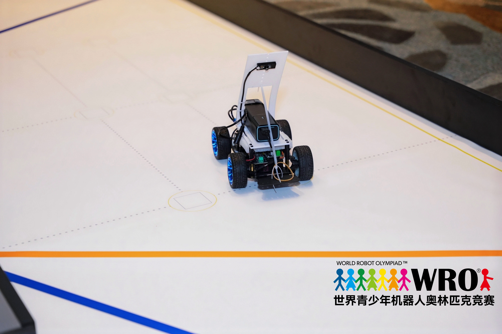

# 车辆照片拍摄规范

## 已加入的比赛现场照片

[`vehicle-competition-run.jpg`](vehicle-competition-run.jpg) 记录车辆在WRO场地上的比赛状态，可用于展示整车外观、摄像头支架、计算平台和实际赛场环境。该照片属于赛事过程证据，不替代下方用于结构审查的标准六视图。

## 最终车辆六视图（待补）

最终车辆应提供至少六个方向的清晰照片，以便裁判确认机械结构、传感器位置和布线。建议统一背景、光线和拍摄距离，照片中只出现最终参赛车辆。

| 推荐文件名 | 拍摄方向 | 必须可见的信息 |
|---|---|---|
| `vehicle-front.jpg` | 正前方 | 前传感器、前轮、车宽 |
| `vehicle-rear.jpg` | 正后方 | 驱动与后部线束 |
| `vehicle-left.jpg` | 左侧 | 轴距、层板和车身高度 |
| `vehicle-right.jpg` | 右侧 | 右侧传感器与安装角度 |
| `vehicle-top.jpg` | 顶部 | 主控、电源、整体布局 |
| `vehicle-bottom.jpg` | 底部 | 差速器、传动轴、走线与固定 |

可额外加入：转向连杆特写、电机标签、电机驱动器标签、总开关与启动按钮、摄像头安装尺寸以及最终接线特写。照片应与提交的代码、CAD 和物料表属于同一版本；当前不需要展示未使用的超声波或编码器接线。

**English:** Additional photographs may show the steering linkage, motor and driver labels, power/start switches, camera mounting dimensions and final wiring. The current vehicle does not use ultrasonic sensors or encoder feedback.
